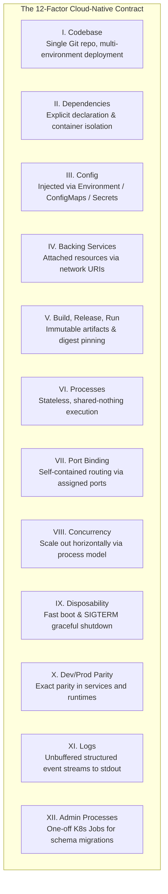

# Module 01: Code to Cloud & 12-Factor App Principles

**Session Reference:** 09:00 – 09:30 ICT  
**Topic:** Introduction to Code to Cloud และหลักการ 12-Factor App  
**Architect Roles:** Lead Cloud Architect & Principal Systems Architect  
**Target Platform:** PROEN Cloud / Cloud-Native Kubernetes

---

## 1. Executive Context & The Cloud-Native Paradigm Shift

Traditional enterprise systems were built as stateful, bespoke monoliths running on long-lived virtual machines or physical servers ("Pets"). When traffic spiked or hardware failed, engineers manually intervened: rebooting servers, modifying local `.ini` configuration files, or scaling vertically by provisioning more RAM and CPU.

In contrast, modern cloud architectures treat compute instances as disposable, ephemeral commodities ("Cattle"). To survive and thrive in this environment, applications must be engineered to:
- Boot in seconds without prerequisite local state.
- Tolerate sudden termination without data corruption or dropped client requests.
- Dynamically scale horizontally from 2 to 200 instances based on real-time load.
- Decouple completely from the underlying operating system and physical network topology.

The **12-Factor App methodology** (originally articulated by Heroku engineers and modernized for Kubernetes and containerized runtimes) provides the baseline architectural contract between application source code and cloud infrastructure.

---

## 2. The 12 Factors Modernized for Cloud & Kubernetes



### Critical Factor Deep-Dives

#### Factor III: Config — Configuration Injected via Environment
- **Principle:** Store configuration that varies between deployment environments (development, staging, production) strictly outside the application codebase.
- **Architectural Implementation:** Never bake environment variables into Docker container layers. In Kubernetes, decouple configuration using `ConfigMap` for non-sensitive values and `Secret` (or External Secrets Operator linked to HashiCorp Vault) for credentials.
- **Litmus Test:** Could the application source code be made open source right now without compromising any production secrets or database credentials? If no, Factor III is violated.

#### Factor VI: Processes — Execute as Stateless, Shared-Nothing Processes
- **Principle:** Application processes must not persist state to local disk or memory across requests.
- **Architectural Implementation:** Sticky sessions in load balancers are an anti-pattern. Session tokens (e.g., JWT) must be cryptographically verified statelessly or stored in a high-speed distributed cache like Redis. User uploads must immediately stream to object storage (e.g., Cloudflare R2 / S3), never to local container filesystems which are wiped upon Pod rescheduling.

#### Factor IX: Disposability — Graceful Shutdown & Fast Boot
- **Principle:** Processes should be disposable, meaning they can start quickly and shut down gracefully at a moment's notice.
- **Architectural Implementation:** When Kubernetes scales down a deployment or drains a worker node, it sends a `SIGTERM` signal to PID 1 inside the container. The application must:
  1. Stop accepting new incoming HTTP connections.
  2. Complete active in-flight requests (up to `terminationGracePeriodSeconds`).
  3. Close active database connection pools and message queue consumers cleanly.
  4. Exit with return code `0`.

---

## 3. Production Architecture Implementation

### 3.1 Enterprise Graceful Shutdown Pattern (Node.js / TypeScript)

```typescript
import http from 'http';
import { Pool } from 'pg';

const dbPool = new Pool({
  connectionString: process.env.DATABASE_URL,
  max: 20,
  idleTimeoutMillis: 30000,
});

const server = http.createServer(async (req, res) => {
  if (req.url === '/healthz') {
    return res.writeHead(200).end('OK');
  }
  // Application business logic...
  res.writeHead(200).end('Processed');
});

const PORT = parseInt(process.env.PORT || '3000', 10);
server.listen(PORT, () => {
  console.log(JSON.stringify({ level: 'info', message: `Server listening on port ${PORT}` }));
});

// Production Graceful Shutdown Signal Handler
const signals: NodeJS.Signals[] = ['SIGTERM', 'SIGINT'];

signals.forEach((signal) => {
  process.on(signal, async () => {
    console.log(JSON.stringify({
      level: 'warn',
      message: `Received ${signal}. Initiating graceful connection draining...`,
      timestamp: new Date().toISOString(),
    }));

    // 1. Stop accepting new connections
    server.close(async (err) => {
      if (err) {
        console.error(JSON.stringify({ level: 'error', message: 'Error closing HTTP server', error: err }));
        process.exit(1);
      }

      console.log(JSON.stringify({ level: 'info', message: 'HTTP server closed. Draining database pool...' }));

      try {
        // 2. Drain database connections cleanly
        await dbPool.end();
        console.log(JSON.stringify({ level: 'info', message: 'Database connections drained. Exiting cleanly.' }));
        process.exit(0);
      } catch (dbErr) {
        console.error(JSON.stringify({ level: 'error', message: 'Failed to drain database connections', error: dbErr }));
        process.exit(1);
      }
    });

    // 3. Fallback force termination timeout (safety valve)
    setTimeout(() => {
      console.error(JSON.stringify({
        level: 'fatal',
        message: 'Graceful shutdown timed out after 25s. Forcing exit.',
      }));
      process.exit(1);
    }, 25000).unref();
  });
});
```

### 3.2 Kubernetes Workload Specification (12-Factor Compliant)

```yaml
apiVersion: apps/v1
kind: Deployment
metadata:
  name: core-order-service
  namespace: production
  labels:
    app.kubernetes.io/name: core-order-service
    app.kubernetes.io/part-of: gvents-platform
spec:
  replicas: 3
  selector:
    matchLabels:
      app.kubernetes.io/name: core-order-service
  strategy:
    type: RollingUpdate
    rollingUpdate:
      maxSurge: 25%
      maxUnavailable: 0
  template:
    metadata:
      labels:
        app.kubernetes.io/name: core-order-service
    spec:
      terminationGracePeriodSeconds: 30
      containers:
        - name: service
          image: registry.proen.cloud/gvents/core-order-service:1.2.0@sha256:d8a9e7f...
          imagePullPolicy: IfNotPresent
          ports:
            - containerPort: 3000
              name: http
          env:
            - name: NODE_ENV
              value: "production"
            - name: PORT
              value: "3000"
            - name: DATABASE_URL
              valueFrom:
                secretKeyRef:
                  name: db-credentials
                  key: database-url
          resources:
            requests:
              cpu: "250m"
              memory: "512Mi"
            limits:
              cpu: "1000m"
              memory: "1024Mi"
          # Health probes preventing premature traffic routing or zombie loops
          startupProbe:
            httpGet:
              path: /healthz
              port: http
            failureThreshold: 30
            periodSeconds: 2
          readinessProbe:
            httpGet:
              path: /healthz
              port: http
            initialDelaySeconds: 5
            periodSeconds: 5
            timeoutSeconds: 2
            successThreshold: 1
            failureThreshold: 3
          livenessProbe:
            httpGet:
              path: /healthz
              port: http
            initialDelaySeconds: 15
            periodSeconds: 10
            timeoutSeconds: 3
            failureThreshold: 3
```

---

## 4. Architectural Trade-Offs & Anti-Patterns

| Category | Anti-Pattern (What Fails in Production) | Enterprise Cloud Architect Solution |
| :--- | :--- | :--- |
| **Config** | Hardcoding API endpoints or embedding `.env.production` into Docker images. | Inject configs via environment variables and Kubernetes `ConfigMap` / `Secret`. |
| **State** | Writing uploaded images or report PDFs to local `/tmp` or `./uploads`. | Stream uploads directly to S3 / Cloudflare R2 object storage with pre-signed URLs. |
| **Logs** | Writing log files to `/var/log/app.log` and configuring `logrotate`. | Stream structured JSON directly to `stdout`/`stderr`. DaemonSet agents collect logs. |
| **Concurrency** | Spawning arbitrary background threads that outlive the HTTP request cycle. | Dispatch background tasks to asynchronous workers via message queues (RabbitMQ/Redis). |
| **Shutdown** | Ignoring `SIGTERM` signals, causing Kubernetes to terminate with `SIGKILL` after 30s. | Register signal handlers to drain connection pools and close active sockets gracefully. |

---

## 5. Production Readiness Checklist

- [ ] **No Local State:** Verified that zero application features depend on local filesystem persistence.
- [ ] **Secret Hygiene:** Scanned git history with GitLeaks / TruffleHog to confirm zero secrets committed.
- [ ] **Clean Probes:** Configured distinct `startupProbe`, `readinessProbe`, and `livenessProbe` definitions.
- [ ] **Resource Envelopes:** Defined explicit `requests` and `limits` for both CPU and Memory.
- [ ] **Structured Logging:** All application output formatted as single-line JSON with timestamps and log levels.
- [ ] **Graceful Drain:** Validated that in-flight requests finish during deployment rollouts without 502/504 Bad Gateway errors.
