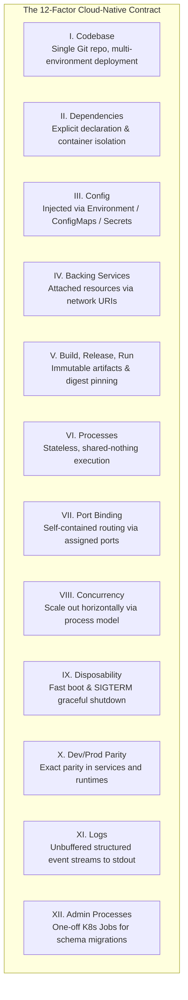

# Module 01: Code to Cloud & 12-Factor App Principles

**Session Reference:** 09:00 – 09:30 ICT  
**Topic:** Introduction to Code to Cloud และหลักการ 12-Factor App  
**Architect Roles:** Lead Cloud Architect & Principal Systems Architect  
**Target Platform:** PROEN Cloud / Cloud-Native Kubernetes

---

## 1. Executive Context & The Cloud-Native Paradigm Shift

Traditional enterprise systems were built as stateful, bespoke monoliths running on long-lived virtual machines or physical servers ("Pets"). When traffic spiked or hardware failed, engineers manually intervened: rebooting servers, modifying local `.ini` configuration files, or scaling vertically by provisioning more RAM and CPU.

In contrast, modern cloud architectures treat compute instances as disposable, ephemeral commodities ("Cattle"). To survive and thrive in this environment, applications must be engineered to:
- Boot in seconds without prerequisite local state.
- Tolerate sudden termination without data corruption or dropped client requests.
- Dynamically scale horizontally from 2 to 200 instances based on real-time load.
- Decouple completely from the underlying operating system and physical network topology.

The **12-Factor App methodology** (originally articulated by Heroku engineers and modernized for Kubernetes and containerized runtimes) provides the baseline architectural contract between application source code and cloud infrastructure.

---

## 2. The 12 Factors Modernized for Cloud & Kubernetes



### Comprehensive 12-Factor Breakdown & Kubernetes Realizations

The 12-Factor App methodology was originally codified by Adam Wiggins (co-founder of Heroku) to establish declarative contracts for cloud portability. In modern cloud-native architectures, Kubernetes acts as the native execution substrate that turns these 12 factors into platform primitives.

> **Official Specification:** [**https://12factor.net/**](https://12factor.net/)

---

#### [I. Codebase](https://12factor.net/codebase) — One codebase tracked in revision control, many deploys
- **Core Principle:** A single repository tracked in version control (Git). Multiple environments (development, staging, production) are distinct deploys from the same codebase. Never fork or maintain separate codebases per customer or environment.
- **Kubernetes Highlight:** A single source repository is built into immutable OCI container image digests. GitOps controllers (Argo CD) pull from configuration repositories that reference these exact image digests across clusters.

#### [II. Dependencies](https://12factor.net/dependencies) — Explicitly declare and isolate dependencies
- **Core Principle:** Applications must never rely on the implicit existence of system-wide packages (e.g., ImageMagick, cURL) on the host machine. All dependencies must be explicitly declared via a manifest (`package.json`, `pom.xml`, `go.mod`).
- **Kubernetes Highlight:** Containerization (`Dockerfile`) hermetically packages the exact runtime binary and all declared dependencies inside minimal base images (Google Distroless), completely eliminating host-level runtime variance.

#### [III. Config](https://12factor.net/config) — Store config in the environment *(Kubernetes Critical)*
- **Core Principle:** Strict separation of configuration from code. Anything that varies between deploys (database credentials, API endpoints, payment keys) must live in environment variables, never hardcoded in source code or baked into image layers.
- **Kubernetes Highlight:** Injected dynamically into Pods via `ConfigMap` (non-sensitive variables) and `Secret` (sensitive credentials) using `envFrom` or volume mounts. In enterprise setups, integrated with the External Secrets Operator (ESO) syncing from HashiCorp Vault.
- **Litmus Test:** Could the application source code be open-sourced this second without leaking credentials?

#### [IV. Backing Services](https://12factor.net/backing-services) — Treat backing services as attached resources *(Kubernetes Critical)*
- **Core Principle:** A backing service is any network service consumed by the app (PostgreSQL, Redis, RabbitMQ, SMTP). The app must make no distinction between local and third-party services, attaching to them via URLs stored in config.
- **Kubernetes Highlight:** Backing services are decoupled using Kubernetes `Service` DNS records (e.g., `postgres.production.svc.cluster.local:5432`). Services can be swapped from in-cluster StatefulSets to managed cloud databases (PROEN DBaaS) without modifying application code.

#### [V. Build, Release, Run](https://12factor.net/build-release-run) — Strictly separate build and run stages *(Kubernetes Critical)*
- **Core Principle:** The delivery pipeline strictly separates three phases:
  1. *Build:* Source code transformed into an immutable executable artifact (container image).
  2. *Release:* Combines the build artifact with environment-specific config.
  3. *Run:* Launches the release in the execution environment.
- **Kubernetes Highlight:** CI pipelines compile code into immutable image digests (e.g., `registry.proen.cloud/gvents/order-service:1.3.0@sha256:...`). Argo CD commits declarative Kustomize releases. Kubernetes executes the Pods. Runtime code patching is strictly forbidden.

#### [VI. Processes](https://12factor.net/processes) — Execute the app as one or more stateless processes *(Kubernetes Critical)*
- **Core Principle:** Applications execute as stateless, share-nothing processes. Sticky sessions are an anti-pattern. Session state lives in Redis/JWT; user uploads stream directly to object storage (S3/Cloudflare R2).
- **Kubernetes Highlight:** Because Pods hold zero persistent state, Kubernetes can evict, reschedule, terminate, or horizontally scale Pods across worker nodes instantly without data loss or user disruption.

#### [VII. Port Binding](https://12factor.net/port-binding) — Export services via port binding *(Kubernetes Critical)*
- **Core Principle:** The cloud app is completely self-contained. It does not rely on runtime injection into an existing web server (like Apache, Tomcat, or IIS). It exports HTTP/gRPC by binding directly to an assigned network port.
- **Kubernetes Highlight:** The container listens directly on `PORT=3000`. Kubernetes maps this via `containerPort: 3000` in `Deployment`, exposes it internally via a `ClusterIP` `Service`, and handles SSL/routing at the cluster edge via Ingress.

#### [VIII. Concurrency](https://12factor.net/concurrency) — Scale out via the process model *(Kubernetes Critical)*
- **Core Principle:** Scale out horizontally by running multiple process instances rather than attempting to scale vertically with large multi-threaded locks on a single giant machine.
- **Kubernetes Highlight:** Implemented natively by Kubernetes `ReplicaSet` and dynamically scaled via `HorizontalPodAutoscaler` (HPA) using CPU, memory, and custom Prometheus metrics (e.g., HTTP request latency).

#### [IX. Disposability](https://12factor.net/disposability) — Maximize robustness with fast startup and graceful shutdown *(Kubernetes Critical)*
- **Core Principle:** Processes must be disposable: quick to start (<5s) and quick to stop gracefully upon receiving termination signals.
- **Kubernetes Highlight:** When a Pod is terminated, Kubernetes sends `SIGTERM`, removes the Pod from Service endpoints via `readinessProbe`, waits up to `terminationGracePeriodSeconds: 30` for in-flight requests to complete, and tears down database pools cleanly.

#### [X. Dev/Prod Parity](https://12factor.net/dev-prod-parity) — Keep development, staging, and production as similar as possible *(Kubernetes Critical)*
- **Core Principle:** Eliminate gaps between development and production. Use the same backing services locally (e.g., run real PostgreSQL in Docker Compose rather than SQLite locally).
- **Kubernetes Highlight:** Identical container images run locally in Docker Compose and in production Kubernetes. Differences between staging and production clusters are maintained declaratively using Kustomize overlays (`overlays/staging` vs `overlays/production`).

#### [XI. Logs](https://12factor.net/logs) — Treat logs as event streams *(Kubernetes Critical)*
- **Core Principle:** An app should never concern itself with routing or storage of its output. It should not write to local log files. Instead, write unbuffered structured JSON to `stdout` and `stderr`.
- **Kubernetes Highlight:** Container stdout/stderr streams are captured by the container runtime (containerd) and harvested by node-level DaemonSets (Promtail, FluentBit, Vector) to centralized log engines (Grafana Loki, OpenSearch).

#### [XII. Admin Processes](https://12factor.net/admin-processes) — Run admin/management tasks as one-off processes *(Kubernetes Critical)*
- **Core Principle:** One-off admin tasks (database schema migrations, batch scripts) should run in identical environments as regular app processes, using identical code and config.
- **Kubernetes Highlight:** Executed as standalone Kubernetes `Job` resources. In GitOps pipelines, orchestrated via Argo CD Sync Waves (Wave 0 migration Job completes before Wave 1 app rollout begins).

---

## 3. Production Architecture Implementation

### 3.1 Enterprise Graceful Shutdown Pattern (Node.js / TypeScript)

```typescript
import http from 'http';
import { Pool } from 'pg';

const dbPool = new Pool({
  connectionString: process.env.DATABASE_URL,
  max: 20,
  idleTimeoutMillis: 30000,
});

const server = http.createServer(async (req, res) => {
  if (req.url === '/healthz') {
    return res.writeHead(200).end('OK');
  }
  // Application business logic...
  res.writeHead(200).end('Processed');
});

const PORT = parseInt(process.env.PORT || '3000', 10);
server.listen(PORT, () => {
  console.log(JSON.stringify({ level: 'info', message: `Server listening on port ${PORT}` }));
});

// Production Graceful Shutdown Signal Handler
const signals: NodeJS.Signals[] = ['SIGTERM', 'SIGINT'];

signals.forEach((signal) => {
  process.on(signal, async () => {
    console.log(JSON.stringify({
      level: 'warn',
      message: `Received ${signal}. Initiating graceful connection draining...`,
      timestamp: new Date().toISOString(),
    }));

    // 1. Stop accepting new connections
    server.close(async (err) => {
      if (err) {
        console.error(JSON.stringify({ level: 'error', message: 'Error closing HTTP server', error: err }));
        process.exit(1);
      }

      console.log(JSON.stringify({ level: 'info', message: 'HTTP server closed. Draining database pool...' }));

      try {
        // 2. Drain database connections cleanly
        await dbPool.end();
        console.log(JSON.stringify({ level: 'info', message: 'Database connections drained. Exiting cleanly.' }));
        process.exit(0);
      } catch (dbErr) {
        console.error(JSON.stringify({ level: 'error', message: 'Failed to drain database connections', error: dbErr }));
        process.exit(1);
      }
    });

    // 3. Fallback force termination timeout (safety valve)
    setTimeout(() => {
      console.error(JSON.stringify({
        level: 'fatal',
        message: 'Graceful shutdown timed out after 25s. Forcing exit.',
      }));
      process.exit(1);
    }, 25000).unref();
  });
});
```

### 3.2 Kubernetes Workload Specification (12-Factor Compliant)

```yaml
apiVersion: apps/v1
kind: Deployment
metadata:
  name: core-order-service
  namespace: production
  labels:
    app.kubernetes.io/name: core-order-service
    app.kubernetes.io/part-of: gvents-platform
spec:
  replicas: 3
  selector:
    matchLabels:
      app.kubernetes.io/name: core-order-service
  strategy:
    type: RollingUpdate
    rollingUpdate:
      maxSurge: 25%
      maxUnavailable: 0
  template:
    metadata:
      labels:
        app.kubernetes.io/name: core-order-service
    spec:
      terminationGracePeriodSeconds: 30
      containers:
        - name: service
          image: registry.proen.cloud/gvents/core-order-service:1.2.0@sha256:d8a9e7f...
          imagePullPolicy: IfNotPresent
          ports:
            - containerPort: 3000
              name: http
          env:
            - name: NODE_ENV
              value: "production"
            - name: PORT
              value: "3000"
            - name: DATABASE_URL
              valueFrom:
                secretKeyRef:
                  name: db-credentials
                  key: database-url
          resources:
            requests:
              cpu: "250m"
              memory: "512Mi"
            limits:
              cpu: "1000m"
              memory: "1024Mi"
          # Health probes preventing premature traffic routing or zombie loops
          startupProbe:
            httpGet:
              path: /healthz
              port: http
            failureThreshold: 30
            periodSeconds: 2
          readinessProbe:
            httpGet:
              path: /healthz
              port: http
            initialDelaySeconds: 5
            periodSeconds: 5
            timeoutSeconds: 2
            successThreshold: 1
            failureThreshold: 3
          livenessProbe:
            httpGet:
              path: /healthz
              port: http
            initialDelaySeconds: 15
            periodSeconds: 10
            timeoutSeconds: 3
            failureThreshold: 3
```

---

## 4. Architectural Trade-Offs & Anti-Patterns

| Category | Anti-Pattern (What Fails in Production) | Enterprise Cloud Architect Solution |
| :--- | :--- | :--- |
| **Config** | Hardcoding API endpoints or embedding `.env.production` into Docker images. | Inject configs via environment variables and Kubernetes `ConfigMap` / `Secret`. |
| **State** | Writing uploaded images or report PDFs to local `/tmp` or `./uploads`. | Stream uploads directly to S3 / Cloudflare R2 object storage with pre-signed URLs. |
| **Logs** | Writing log files to `/var/log/app.log` and configuring `logrotate`. | Stream structured JSON directly to `stdout`/`stderr`. DaemonSet agents collect logs. |
| **Concurrency** | Spawning arbitrary background threads that outlive the HTTP request cycle. | Dispatch background tasks to asynchronous workers via message queues (RabbitMQ/Redis). |
| **Shutdown** | Ignoring `SIGTERM` signals, causing Kubernetes to terminate with `SIGKILL` after 30s. | Register signal handlers to drain connection pools and close active sockets gracefully. |

---

## 5. Production Readiness Checklist

- [ ] **No Local State:** Verified that zero application features depend on local filesystem persistence.
- [ ] **Secret Hygiene:** Scanned git history with GitLeaks / TruffleHog to confirm zero secrets committed.
- [ ] **Clean Probes:** Configured distinct `startupProbe`, `readinessProbe`, and `livenessProbe` definitions.
- [ ] **Resource Envelopes:** Defined explicit `requests` and `limits` for both CPU and Memory.
- [ ] **Structured Logging:** All application output formatted as single-line JSON with timestamps and log levels.
- [ ] **Graceful Drain:** Validated that in-flight requests finish during deployment rollouts without 502/504 Bad Gateway errors.
