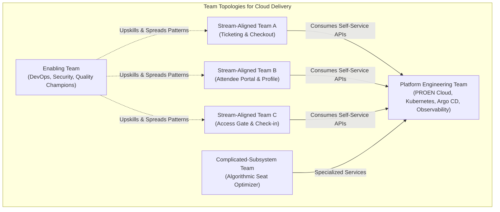
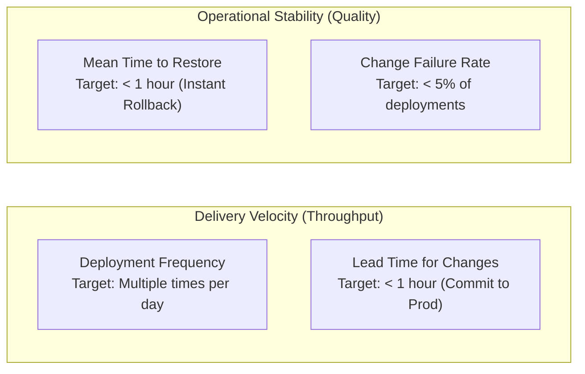

# Module 02: Learning Mindset & High-Performing Engineering Culture

**Session Reference:** 09:30 – 10:30 ICT  
**Topic:** Learning Mindset Training & High-Performing Cloud Engineering Culture  
**Architect Roles:** Lead Cloud Architect & Principal Systems Architect  
**Core Frameworks:** Socio-Technical Systems, Conway's Law, Team Topologies, DORA Metrics

---

## 1. Executive Context & The Socio-Technical Reality

Technology alone never guarantees a successful cloud transformation. An enterprise can purchase cutting-edge cloud infrastructure, implement Kubernetes, and enforce GitOps tools, yet still suffer from sluggish delivery cycles, catastrophic production outages, and high engineering burnout.

As articulated by **Melvin Conway (1967)**:
> *"Organizations which design systems are constrained to produce designs which are copies of the communication structures of these organizations."*

In modern cloud engineering, **architecture and organizational culture are two sides of the exact same coin**. A rigid, siloed, risk-averse organization will invariably produce brittle, tightly-coupled distributed monoliths. Conversely, teams that cultivate psychological safety, high continuous learning, and blameless retrospectives naturally evolve loosely-coupled, resilient architectures that ship changes continuously.

---

## 2. Socio-Technical Architecture: Conway's Law & Team Topologies

To succeed with Cloud-Native delivery, senior architects must structure engineering teams to match the desired software architecture (**Inverse Conway Maneuver**).



### The Four Fundamental Team Types
1. **Stream-Aligned Teams:** Aligned to a single, continuous stream of business value. They have end-to-end ownership of their service from code commit to production monitoring.
2. **Platform Teams:** Provide an underlying Internal Developer Platform (IDP) that enables Stream-Aligned teams to deliver work autonomously without managing underlying VM or network provisioning.
3. **Enabling Teams:** Cross-functional specialists (e.g., Cloud Architects, Security Auditors) who spread modern practices, run hands-on workshops, and eliminate knowledge silos.
4. **Complicated-Subsystem Teams:** Dedicated to specialized, mathematically intensive domains (e.g., real-time cryptographic ticket validation, geospatial search).

---

## 3. DORA Metrics: Measuring Engineering Excellence

Elite cloud organizations measure technical velocity and stability using the **DORA (DevOps Research and Assessment)** core metrics:



| Metric | Low Performer | Medium Performer | Elite Cloud-Native Performer |
| :--- | :--- | :--- | :--- |
| **Deployment Frequency** | Monthly or Quarterly batches | Once every 1–4 weeks | **On-demand (Multiple deploys/day)** |
| **Lead Time for Changes** | 1 to 6 months | 1 to 4 weeks | **Less than 1 hour** |
| **Mean Time to Restore (MTTR)** | Several days to a week | 1 day | **Less than 30 minutes (Git revert)** |
| **Change Failure Rate** | 46% – 60% | 16% – 30% | **0% – 5%** |

---

## 4. Psychological Safety & The Blameless Postmortem

When a production incident occurs, low-performing organizations search for **who** made the mistake, resulting in hidden failures, fear of deployment, and reduced velocity. High-performing engineering organizations understand that **human error is a symptom of system design flaws, not the root cause**.

### The "5 Whys" Root Cause Analysis (RCA) Framework

*Example Incident: Production Database Exhausted Connection Pool during Ticket Rush.*

1. **Why did the checkout API start returning 500 errors?**  
   *Because the backend service could not establish new PostgreSQL connections.*
2. **Why was the connection pool exhausted?**  
   *Because each incoming request was opening a new connection instead of reusing the pool.*
3. **Why were connections not being returned to the pool?**  
   *Because an unhandled Promise rejection in the ticket transfer logic bypassed the `release()` block.*
4. **Why was there an unhandled Promise rejection in production?**  
   *Because the edge case (recipient user declining transfer) was not covered in integration test suites.*
5. **Why was that scenario omitted from test suites?**  
   *Because the team lacked an automated contract-testing matrix for asynchronous transfer workflows.*

**Corrective Action:** Implement automated PR test coverage gates and connection pool circuit breakers—**never** reprimand the engineer who wrote the code.

---

## 5. Enterprise Incident Postmortem Template

```markdown
# Incident Postmortem: [INCIDENT-ID-YYYYMMDD]

## 1. Incident Overview
- **Date & Time:** 2026-09-21 14:15 – 14:42 ICT
- **Severity Level:** Sev-1 (Critical Business Impact)
- **Incident Commander:** Lead Cloud Architect
- **Impact Assessment:** 27 minutes of checkout degradation; 140 transactions failed; estimated revenue delayed: 42,000 THB.

## 2. Executive Summary
A memory leak in the ticket generation worker caused worker Pods to exceed their memory limits (OOMKilled), leading to a cascading crash loop. Traffic failed over to surviving replicas which then experienced CPU saturation.

## 3. Incident Chronological Timeline (ICT)
- **14:15:** Deployment `v2.4.1` reconciled by Argo CD.
- **14:18:** Prometheus alert `PodMemorySaturationHigh` triggered for checkout pods.
- **14:22:** Kubernetes terminated 3 of 4 replicas via `OOMKilled (Exit Code 137)`.
- **14:25:** Ingress controller began logging 502/504 errors. Incident declared Sev-1.
- **14:31:** Incident Commander initiated GitOps rollback commit in config repository.
- **14:33:** Argo CD synced cluster state to stable release `v2.4.0`.
- **14:36:** Pods stabilized; memory consumption normalized at 380Mi.
- **14:42:** Ingress error rate dropped below 0.01%. Incident closed.

## 4. Root Cause Analysis
The image processing library retained uncompressed buffer references in a global cache during high-concurrency ticket badge rendering. Under heavy traffic, heap allocation exceeded the 1Gi container memory limit.

## 5. Corrective Action Items (Preventative Safeguards)
| Action Item | Owner / DRI | Target Date | Status |
| :--- | :--- | :--- | :--- |
| Enforce streaming buffer allocations for ticket rendering | Lead Backend Eng | 2026-09-23 | In Progress |
| Add memory soak test to automated CI pipeline | QA Concurrency Eng | 2026-09-25 | Planned |
| Lower Prometheus OOM early-warning threshold to 80% | Cloud Architect | 2026-09-22 | Completed |
| Configure Vertical Pod Autoscaler (VPA) recommendation mode | Platform Lead | 2026-09-28 | Planned |
```

---

## 6. Architecture Decision Records (ADR) Protocol

Senior architects govern architectural evolution using **Architecture Decision Records (ADRs)** stored directly alongside source code in version control:

```markdown
# ADR-0014: Adoption of Argo CD as Primary GitOps Deployment Engine

## Context & Problem Statement
Our current deployment pipeline relies on Jenkins pushing configurations directly to our Kubernetes clusters via `kubectl apply`. This requires granting Jenkins administrator privileges inside production clusters, violating our zero-trust security architecture. Furthermore, manual changes made to clusters are not tracked, causing configuration drift.

## Decision Drivers
- Zero-trust security: Eliminate cluster credentials from external CI runners.
- Declarative drift detection: Automatically revert out-of-band manual changes.
- Disaster recovery: Recreate entire cluster environments from Git within 15 minutes.

## Considered Options
1. Argo CD (CNCF Graduated GitOps Controller)
2. Flux CD (CNCF Graduated GitOps Toolkit)
3. Direct Helm deployment via GitHub Actions (Status Quo)

## Decision Outcome
Chosen Option: **Argo CD**.  
Provides superior enterprise multi-cluster management, native SSO/OIDC integration, comprehensive UI visualization for operations teams, and native support for Sync Waves and Health Checks.
```
