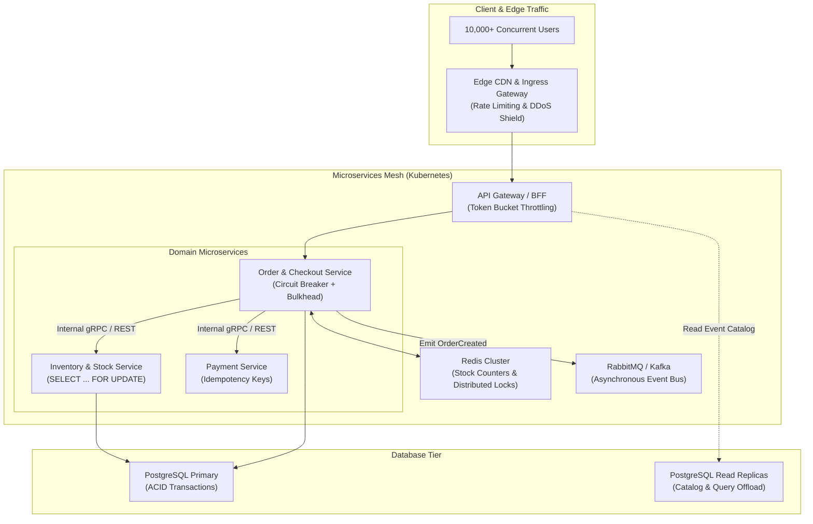
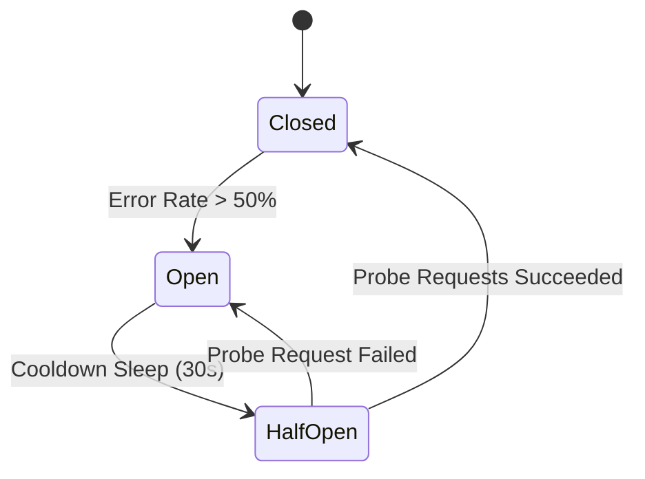

# Module 03: Microservices Architecture & High-Traffic System Management

**Session Reference:** 10:45 – 11:15 ICT  
**Topic:** Microservices Architecture, Design Patterns และการบริหารระบบที่มี Traffic จำนวนมาก  
**Architect Roles:** Lead Cloud Architect & Principal Systems Architect  
**Domain Focus:** High-Concurrency Ticketing, Flash Sales & Distributed Systems Resiliency

---

## 1. Executive Context: The High-Traffic Challenge

In enterprise ticketing and flash-sale platforms, traffic is not smooth or predictable; it arrives in **near-vertical spikes**. When registrations open for a premier event at 10:00:00 ICT, thousands of concurrent users click "Checkout" within the same sub-second window.

Traditional architectures fail during traffic surges due to:
1. **Overselling & Race Conditions:** Two concurrent threads read `stock = 1`, and both proceed to write `stock = 0`, selling 2 tickets for a single physical seat.
2. **Cascading Failure:** A slow payment gateway saturates thread pools across upstream microservices, crashing the entire platform.
3. **Database Connection Starvation:** Hundreds of application replicas attempt to open database connections simultaneously, exceeding PostgreSQL's `max_connections`.
4. **Cache Stampede (Thundering Herd):** A popular cache key expires during peak traffic, sending 10,000 requests directly to the database to compute the same value.

---

## 2. Microservices Design Patterns for Scale



### Pattern 1: Database-per-Service vs Distributed Transactions
- **Rule:** Never allow multiple microservices to read and write to the same relational tables directly. A shared database creates tight coupling, hidden schema dependencies, and deadlock vulnerability.
- **Distributed Consistency (The Saga Pattern):** Distributed 2-Phase Commit (2PC) does not scale in cloud environments. Use **Sagas** instead:
  - **Orchestration Saga:** A central coordinator service directs participants, listens for replies, and triggers compensating transactions (e.g., releasing reserved ticket stock) if a downstream step (like credit card capture) fails.

### Pattern 2: Circuit Breaker & Bulkhead Isolation
- **Closed State:** Normal operations; requests pass through.
- **Open State:** If downstream failure rate exceeds a threshold (e.g., 50% over 10 seconds), the circuit opens immediately. Requests fail fast with a cached fallback or graceful error without waiting for connection timeouts.
- **Half-Open State:** After a cooldown period (e.g., 30s), test requests are permitted through. If successful, normal operations resume.



---

## 3. High-Concurrency Concurrency & Stock Protection

To completely eliminate double-booking and race conditions during high-volume sales, architects employ **Pessimistic Row-Level Locking (`SELECT ... FOR UPDATE`)** combined with atomic Redis counters.

### 3.1 Production Implementation: Row-Level Locking in PostgreSQL

```typescript
import { Injectable, BadRequestException, ConflictException } from '@nestjs/common';
import { Pool, PoolClient } from 'pg';

@Injectable()
export class TicketReservationService {
  constructor(private readonly dbPool: Pool) {}

  /**
   * Reserving tickets safely under extreme concurrency
   */
  async reserveTicket(eventId: number, tierId: number, userId: string): Promise<string> {
    const client: PoolClient = await this.dbPool.connect();

    try {
      // 1. Begin atomic database transaction
      await client.query('BEGIN');

      // 2. Acquire exclusive ROW-LEVEL LOCK on the specific ticket tier
      // Crucial: SELECT ... FOR UPDATE blocks concurrent transactions until this commit completes.
      const tierQuery = `
        SELECT id, name, total_capacity, issued_count, is_active
        FROM ticket_tiers
        WHERE id = $1 AND event_id = $2
        FOR UPDATE;
      `;
      const tierResult = await client.query(tierQuery, [tierId, eventId]);

      if (tierResult.rows.length === 0) {
        throw new BadRequestException('Ticket tier not found or invalid');
      }

      const tier = tierResult.rows[0];

      if (!tier.is_active) {
        throw new BadRequestException('This ticket tier is currently closed');
      }

      // 3. Strict capacity validation inside the locked state
      const remainingStock = tier.total_capacity - tier.issued_count;
      if (remainingStock <= 0) {
        throw new ConflictException('Sold Out: No remaining tickets available in this tier');
      }

      // 4. Increment issued count atomically
      await client.query(
        `UPDATE ticket_tiers SET issued_count = issued_count + 1, updated_at = NOW() WHERE id = $1;`,
        [tierId],
      );

      // 5. Create reservation record with temporary hold (15 minutes)
      const reservationId = `res_${Date.now()}_${Math.random().toString(36).substr(2, 9)}`;
      const expiresAt = new Date(Date.now() + 15 * 60 * 1000); // 15-minute hold

      await client.query(
        `INSERT INTO ticket_reservations (id, event_id, tier_id, user_id, status, expires_at, created_at)
         VALUES ($1, $2, $3, $4, 'HELD', $5, NOW());`,
        [reservationId, eventId, tierId, userId, expiresAt],
      );

      // 6. Commit transaction and release row lock immediately
      await client.query('COMMIT');

      return reservationId;
    } catch (error) {
      await client.query('ROLLBACK');
      throw error;
    } finally {
      // Always return client connection back to pool
      client.release();
    }
  }
}
```

---

## 4. Cache Stampede Mitigation: Probabilistic Early Expiration (XFetch)

When caching heavy database query results (e.g., complex event layouts and seat availability), traditional TTL expiration causes thousands of simultaneous backend queries at the exact moment of expiry.

### The Optimal Solution: XFetch Algorithm
Instead of waiting for the key to expire, worker threads proactively recompute the cache if:
$$\Delta \cdot \beta \cdot \ln(\text{rand}()) > \text{TTL} - \text{time}()$$

```typescript
import Redis from 'ioredis';

export class ResilientCacheManager {
  constructor(private readonly redis: Redis) {}

  async getOrCompute<T>(
    key: string,
    computeFn: () => Promise<T>,
    ttlSeconds: number,
    beta: number = 1.0,
  ): Promise<T> {
    const cached = await this.redis.get(key);

    if (cached) {
      const entry = JSON.parse(cached);
      const remainingTtl = (entry.expiryTimestamp - Date.now()) / 1000;

      // XFetch early computation condition
      const shouldRecompute = -(entry.computeDurationSeconds * beta * Math.log(Math.random())) > remainingTtl;

      if (!shouldRecompute) {
        return entry.data as T;
      }
    }

    // Acquire lightweight distributed lock to ensure only ONE instance recomputes
    const lockKey = `lock:${key}`;
    const acquired = await this.redis.set(lockKey, 'locked', 'EX', 10, 'NX');

    if (!acquired && cached) {
      // Another worker is already updating; return existing stale data safely
      return JSON.parse(cached).data as T;
    }

    const start = Date.now();
    const freshData = await computeFn();
    const durationSeconds = (Date.now() - start) / 1000;

    const payload = {
      data: freshData,
      expiryTimestamp: Date.now() + ttlSeconds * 1000,
      computeDurationSeconds: durationSeconds,
    };

    await this.redis.set(key, JSON.stringify(payload), 'EX', ttlSeconds);
    await this.redis.del(lockKey);

    return freshData;
  }
}
```

---

## 5. Architectural Trade-Offs & Anti-Patterns

| Failure Mode | Naive Approach (System Crash) | Cloud Architect Pattern |
| :--- | :--- | :--- |
| **Concurrency Overselling** | `UPDATE tiers SET stock = stock - 1` without lock. | `SELECT ... FOR UPDATE` row lock inside atomic transaction. |
| **Dependency Failure** | Infinite HTTP client retries without timeout. | Circuit Breaker + Timeout + Exponential Backoff with Jitter. |
| **Traffic Spike** | All requests hit database directly. | Redis token bucket rate limiting at Ingress + Read Replicas. |
| **Database Pool Overload** | Every Pod runs 100 connections (`max_connections` blown). | PgBouncer connection pooler in Transaction Pooling mode. |

---

## 6. High-Traffic Rush Day Readiness Runbook

1. **Pre-Warm Caches:** Warm up CDN edge caches and Redis clusters 60 minutes prior to ticket release.
2. **Pre-Scale Pods:** Do not rely on reactive Horizontal Pod Autoscalers (HPA) during sudden surges (HPA takes 2–3 minutes to spin up new pods). Set `minReplicas` to peak requirement 30 minutes in advance.
3. **Activate Rate Limiting:** Enforce per-IP and per-user token buckets at the Ingress controller to shed malicious automated bot scrapers.
4. **Verify Database Connections:** Ensure `pool.max * replicaCount < pgbouncer.max_client_conn`.
