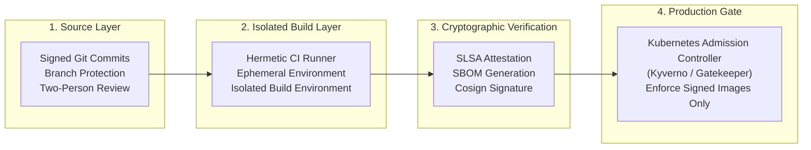

# Module 04: Software Supply Chain Management & DevSecOps

**Session Reference:** 11:15 – 12:00 ICT  
**Topic:** Software Supply Chain Management & Cryptographic Artifact Verification  
**Architect Roles:** Lead Cloud Architect & Principal Security Architect  
**Frameworks:** SLSA (Supply-chain Levels for Software Artifacts), SBOM, Cosign, Sigstore, Distroless

---

## 1. Executive Context & Modern Threat Vectors

Modern enterprise applications are composed of **80% to 90% third-party open-source dependencies** and container base layers; custom proprietary code represents only a thin surface layer.

Historically, organizations focused security exclusively on perimeter firewalls and application runtime penetration testing. However, attackers have shifted their primary attack vectors to the **Software Supply Chain**:
- **Dependency Hijacking & Typosquatting:** Compromising popular npm/PyPI libraries or publishing malicious variants (e.g., `event-stream`, `colors.js`).
- **Build System Compromise:** Injecting malicious payloads directly during CI compilation (e.g., SolarWinds, Codecov bash uploader breach).
- **Vulnerable Container Base Images:** Running official images containing unpatched system vulnerabilities (OpenSSL, glibc, curl).
- **Registry Tampering:** Overwriting mutable tags (`latest`, `v1.0.0`) in container registries with compromised binaries.

In a zero-trust cloud architecture, an artifact cannot be trusted simply because it exists in an internal container registry. It must possess **cryptographic proof of provenance, integrity, and compliance**.

---

## 2. The SLSA Framework & Supply Chain Layers

The **SLSA (Supply-chain Levels for Software Artifacts)** framework defines progressive security standards to guarantee build integrity:



- **SLSA Level 1:** Build process is automated; build provenance is documented.
- **SLSA Level 2:** Build runs in an authenticated hosted service; provenance is cryptographically signed.
- **SLSA Level 3:** Build environment is isolated and ephemeral; provenance is non-falsifiable.
- **SLSA Level 4:** Two-person code review required; builds are hermetic and fully reproducible.

---

## 3. Core Architectural Implementations

### 3.1 Hardened Multi-Stage Dockerfile (Distroless & Non-Root)

Running containers as `root` with complete Linux shells (`/bin/bash`, `curl`, `apt`) provides attackers with instant lateral movement upon an exploit. Production containers must be **minimal, non-root, and distroless**.

```dockerfile
# ==============================================================================
# STAGE 1: Build & Compilation (Hermetic Environment)
# ==============================================================================
FROM node:22-alpine AS builder

WORKDIR /usr/src/app

# Leverage caching for dependency installation
COPY package.json pnpm-lock.yaml ./
RUN npm install -g pnpm@9.1.0 && pnpm install --frozen-lockfile

COPY . .

# Run unit tests and production build
RUN pnpm test && pnpm build

# Prune development dependencies
RUN pnpm prune --prod

# ==============================================================================
# STAGE 2: Production Distroless Runtime (Zero Shell, Zero Package Manager)
# ==============================================================================
# Google Container Registry Distroless Node.js Image
FROM gcr.io/distroless/nodejs22-debian12:nonroot AS runner

WORKDIR /app

# Copy application artifacts from builder
COPY --from=builder --chown=nonroot:nonroot /usr/src/app/package.json ./
COPY --from=builder --chown=nonroot:nonroot /usr/src/app/node_modules ./node_modules
COPY --from=builder --chown=nonroot:nonroot /usr/src/app/dist ./dist

# Non-root user execution (UID 65532 is nonroot in distroless)
USER nonroot

ENV NODE_ENV=production \
    PORT=3000

EXPOSE 3000

# Entrypoint without shell wrapper prevents shell injection
CMD ["dist/main.js"]
```

*Architectural Impact: Standard Node images contain ~800 OS packages and 40+ known CVEs; Distroless reduces OS packages to ~20 and CVEs to **0**.*

---

### 3.2 Automated CI Pipeline: SBOM Generation & Image Signing

```yaml
name: Secure Supply Chain Build & Verification

on:
  push:
    branches: [main]
    tags: ['v*']

jobs:
  build-and-sign:
    runs-on: ubuntu-latest
    permissions:
      contents: read
      packages: write
      id-token: write # Required for Sigstore keyless OIDC authentication

    steps:
      - name: Checkout Source Code
        uses: actions/checkout@v4

      - name: Set up Docker Buildx
        uses: docker/setup-buildx-action@v3

      - name: Install Cosign & Syft
        uses: sigstore/cosign-installer@v3.5.0
      
      - name: Install Syft (SBOM Generator)
        run: curl -sSfL https://raw.githubusercontent.com/anchore/syft/main/install.sh | sh -s -- -b /usr/local/bin

      - name: Build & Push OCI Image to Registry
        id: build-image
        uses: docker/build-push-action@v5
        with:
          context: .
          push: true
          tags: |
            registry.proen.cloud/gvents/core-api:${{ github.sha }}
            registry.proen.cloud/gvents/core-api:latest

      # Step 1: Generate Software Bill of Materials (SBOM) in SPDX and CycloneDX formats
      - name: Generate SBOM (CycloneDX JSON)
        run: |
          syft registry.proen.cloud/gvents/core-api:${{ github.sha }} -o cyclonedx-json > sbom.cyclonedx.json

      # Step 2: Scan image and fail on Critical or High CVEs
      - name: Vulnerability Scan with Trivy
        uses: aquasecurity/trivy-action@0.20.0
        with:
          image-ref: registry.proen.cloud/gvents/core-api:${{ github.sha }}
          format: 'table'
          exit-code: '1' # Block pipeline on critical vulnerabilities
          ignore-unfixed: true
          severity: 'CRITICAL,HIGH'

      # Step 3: Cryptographically Sign the Container Image with Cosign
      - name: Sign Container Image (Keyless OIDC)
        run: |
          cosign sign --yes registry.proen.cloud/gvents/core-api:${{ github.sha }}

      # Step 4: Attach SBOM as a Signed Attestation to the OCI Registry
      - name: Attest SBOM
        run: |
          cosign attest --yes --predicate sbom.cyclonedx.json --type cyclonedx registry.proen.cloud/gvents/core-api:${{ github.sha }}
```

---

## 4. Kubernetes Admission Control: Enforcing Cryptographic Signatures

To ensure that untrusted or unsigned images cannot run inside PROEN Cloud clusters, architects deploy **Kyverno** or **OPA Gatekeeper** policies at the API server admission boundary:

```yaml
apiVersion: kyverno.io/v1
kind: ClusterPolicy
metadata:
  name: verify-image-signatures
spec:
  validationFailureAction: Enforce
  webhookTimeoutSeconds: 15
  rules:
    - name: verify-gvents-signatures
      match:
        any:
          - resources:
              kinds:
                - Pod
      verifyImages:
        - imageReferences:
            - "registry.proen.cloud/gvents/*"
          attestors:
            - count: 1
              entries:
                - keyless:
                    issuer: "https://token.actions.githubusercontent.com"
                    subject: "https://github.com/gvents-org/*"
```

*Result: If an engineer or compromised CI script attempts to deploy an unsigned container via `kubectl run malicious --image=untrusted:latest`, Kubernetes rejects the API call with HTTP 403 Forbidden.*

---

## 5. Architectural Checklist for Supply Chain Hardening

- [ ] **Pinned Dependencies:** All lockfiles (`pnpm-lock.yaml`, `package-lock.json`, `go.sum`) are committed and verified with `--frozen-lockfile`.
- [ ] **Distroless Base:** Production images derive from `gcr.io/distroless/*` or Chainguard images without shells.
- [ ] **Non-Root User:** Containers enforce `USER 10001` or `USER nonroot`.
- [ ] **Read-Only Root Filesystem:** Kubernetes Pod security context enforces `readOnlyRootFilesystem: true`.
- [ ] **SBOM Generated:** Every release artifact generates a CycloneDX/SPDX SBOM pushed to the container registry.
- [ ] **Cryptographically Signed:** Images signed via Cosign prior to Argo CD GitOps repository update.
- [ ] **Admission Gating:** Cluster admission controller blocks unverified images in production namespaces.
