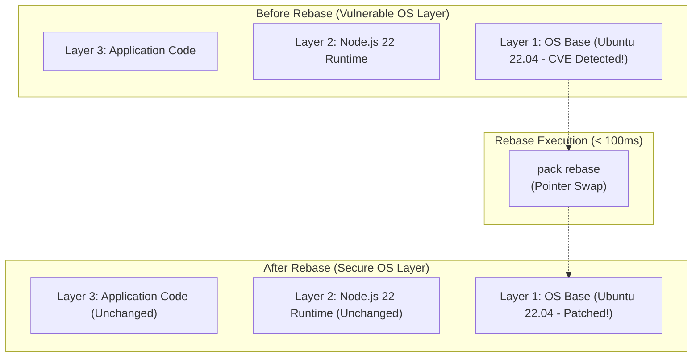

# Module 05: Enterprise Cloud Runtimes & Platform Abstraction

**Session Reference:** 13:00 – 13:20 ICT  
**Topic:** Here is my source code. Run it in the cloud… I do not care how  
**Presented by:** VMware by Broadcom (คุณชาลี คัมภีรภาพ, Solution Architect)  
**Architect Roles:** Lead Cloud Architect & Principal Enterprise Architect  
**Technologies:** Cloud Native Buildpacks, Paketo, VMware Tanzu Application Platform, Cloud Foundry

---

## 1. Executive Context: The Developer Experience (DX) Paradox

In many enterprises, the transition to Kubernetes and microservices dramatically increased **developer cognitive load**:
- Application developers who previously focused on writing business logic were suddenly forced to author and debug complex `Dockerfile` layers, write 500-line Kubernetes YAML manifests (`Deployment`, `Service`, `Ingress`, `HorizontalPodAutoscaler`, `NetworkPolicy`), and manage cluster networking.
- Meanwhile, central platform and security teams lost governance: developers copy-pasted unvetted Dockerfiles containing outdated base images, outdated security patches, and root-user privileges.

The philosophy behind modern platform engineering—pioneered by Cloud Foundry and evolved through **VMware Tanzu Application Platform (TAP)**—is straightforward:
> **"Here is my source code. Run it in the cloud… I do not care how."**

The platform must draw a clean architectural boundary between the **Inner Loop** (developer writing code) and the **Outer Loop** (governed container building, security scanning, network wiring, and cloud deployment).

```mermaid
flowchart LR
    subgraph Inner_Loop["Developer Inner Loop (Fast Feedback)"]
        DEV["Engineer Writes Code"]
        GIT["git push origin main"]
        DEV --> GIT
    end

    subgraph Enterprise_Platform["Automated Platform Boundary (VMware Tanzu / Buildpacks)"]
        DETECT["Auto-Detect Language & Framework (Node.js / Java / Go)"]
        BUILDPACK["Paketo Cloud Native Buildpacks<br/>(Hardened OS + Runtime)"]
        SBOM_GEN["Auto-Generate SBOM & Labels"]
        OCI_IMAGE["Standard OCI Container Image"]
        K8S_WIRING["Auto-Generate K8s Routing & Ingress"]
    end

    subgraph Cloud_Runtime["PROEN Cloud & Kubernetes Runtime"]
        RUN["Zero-Downtime Workload Running & Monitored"]
    end

    GIT --> DETECT --> BUILDPACK --> SBOM_GEN --> OCI_IMAGE --> K8S_WIRING --> RUN
```



---

## 2. Cloud Native Buildpacks vs. Traditional Dockerfiles

Traditional `Dockerfile` approaches suffer from three enterprise architectural flaws:
1. **No Central Patching:** When an OS vulnerability (e.g., OpenSSL CVE) is announced, security teams cannot update 500 microservices without asking 500 developers to edit their Dockerfiles, trigger recompilations, and re-test.
2. **Duplicated Boilerplate:** Every development team reinvents caching, non-root user setup, and multi-stage build patterns.
3. **Inefficient Layering:** Novice Dockerfile ordering breaks layer caching, producing slow builds and massive image bloat.

### The Cloud Native Buildpacks Solution (CNCF / Paketo)
Buildpacks inspect application source code, automatically detect the language and runtime, and generate production-ready, standardized OCI container images **without needing a Dockerfile**.

```bash
# Building an enterprise-grade container directly from source code
pack build registry.proen.cloud/gvents/core-api:1.2.0 \
  --builder paketobuildpacks/builder-jammy-base \
  --env BP_NODE_VERSION=22.* \
  --publish
```

### The "Rebase" Superpower: Instant Zero-Compile Security Patching
Because Buildpacks enforce strict separation between the OS base layer, language runtime layer, and application code layer, an enterprise security team can **patch the underlying operating system in seconds without rebuilding or recompiling the application code**:

```bash
# Rebase 100 microservices to a newly patched OS base layer in seconds
pack rebase registry.proen.cloud/gvents/core-api:1.2.0
```



---

## 3. Architecture Comparison Matrix

| Architectural Dimension | Imperative Dockerfiles | Cloud Native Buildpacks | Enterprise PaaS (VMware Tanzu / Cloud Foundry) |
| :--- | :--- | :--- | :--- |
| **Developer Cognitive Load** | High (must master Docker syntax) | Low (run single CLI command) | **Zero (git push triggers entire supply chain)** |
| **Security Governance** | Distributed, difficult to enforce | Centralized via Builder images | **Fully centralized policy & compliance gates** |
| **OS Patching Velocity** | Slow (rebuild entire app per CVE) | Instant (OCI layer rebasing) | **Automated platform runtime rollouts** |
| **Kubernetes Complexity** | Developers write all manifests | Developers write manifests | **Platform choreographs Knative/Ingress wiring** |
| **Multi-Cloud Portability** | Standard OCI containers | Standard OCI containers | **Runs across PROEN Cloud, VMware, AWS, Azure** |

---

## 4. Architectural Implementation: VMware Tanzu Workload Specification

With a modern platform runtime like Tanzu Application Platform, the developer declares their intent via a concise, high-level custom resource rather than maintaining hundreds of lines of low-level Kubernetes primitives:

```yaml
apiVersion: carto.run/v1alpha1
kind: Workload
metadata:
  name: gvents-order-service
  namespace: apps
  labels:
    app.tanzu.vmware.com/workload-type: web
    app.kubernetes.io/part-of: gvents-platform
spec:
  source:
    git:
      url: https://github.com/gvents-org/core-order-service.git
      ref:
        branch: main
  env:
    - name: NODE_ENV
      value: "production"
  resources:
    requests:
      memory: "512Mi"
      cpu: "250m"
    limits:
      memory: "1024Mi"
      cpu: "1000m"
```

*The underlying supply chain controller automatically handles: source polling -> Buildpack containerization -> image signing -> Knative auto-scaling -> TLS certificate issuance -> Ingress routing.*

---

## 5. Architectural Takeaways for Enterprise Systems

1. **Protect Developer Focus:** Do not force application engineers to become Kubernetes administrators. Provide them with clean abstraction interfaces.
2. **Decouple App Life from OS Life:** Adopt OCI layer rebasing so infrastructure and security engineers can patch CVEs independently of application release cycles.
3. **Standardize Build Environments:** Eliminate idiosyncratic developer machine builds by enforcing container compilation in hermetic, standardized platform runners.
