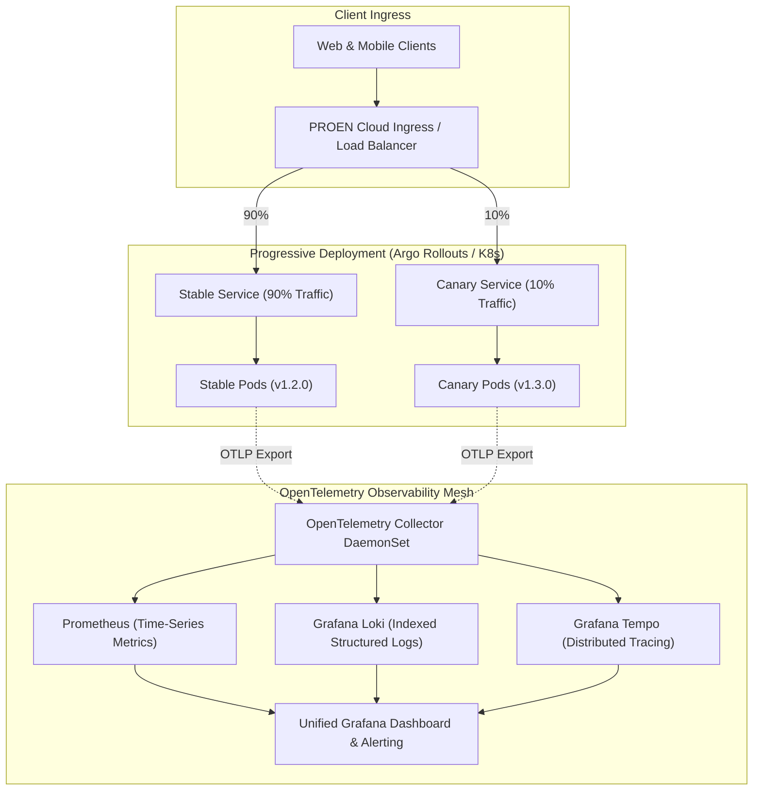

# Module 06: Cloud Services, Deployment Strategies & Full-Stack Observability

**Session Reference:** 13:20 – 14:00 ICT  
**Topic:** Cloud Services, Deployment และ Observability  
**Architect Roles:** Lead Cloud Architect & Principal Observability Engineer  
**Infrastructure:** PROEN Cloud Infrastructure, Kubernetes, OpenTelemetry, Prometheus, Grafana

---

## 1. Executive Context & Infrastructure Topology

Enterprise applications deployed on **PROEN Cloud** demand high availability, low network latency, and continuous visibility. Running services blindly without comprehensive telemetry turns every production anomaly into a multi-hour outage.

Modern cloud operations require two foundational capabilities:
1. **Zero-Downtime Deployment Strategies:** Ensuring that rolling out new code never disconnects active users or causes dropped transactions.
2. **Full-Stack Observability:** Not just collecting raw logs, but synthesizing the **Three Pillars of Observability (Metrics, Logs, Traces)** into actionable, correlation-linked diagnostics.



---

## 2. Progressive Deployment Strategies: A Comparative Analysis

| Deployment Pattern | Traffic Routing Mechanism | Rollback Speed | Resource Overhead | Production Risk |
| :--- | :--- | :--- | :--- | :--- |
| **Recreate** | Terminate old version -> Spin up new version | Slow (Minutes) | Zero extra compute | Very High (Downtime guaranteed) |
| **Rolling Update** | Replace pods incrementally (`maxSurge`, `maxUnavailable`) | Medium (Rollout undo) | Low (10%–25% surge) | Medium (Mixed versions concurrently) |
| **Blue/Green** | Stand up entire Green environment -> Atomic switch | Instant (< 2 seconds) | High (200% compute during deploy) | Low (Instant traffic toggle) |
| **Canary** | Route 5%–10% traffic to Canary -> Validate -> 100% | Instant (< 5 seconds) | Minimal (5%–10% surge) | **Lowest (Defects impact tiny blast radius)** |

### Canary Deployment Manifest (Argo Rollouts)

```yaml
apiVersion: argoproj.io/v1alpha1
kind: Rollout
metadata:
  name: core-ticket-api
  namespace: production
spec:
  replicas: 10
  strategy:
    canary:
      # Automatically step traffic from 10% -> 25% -> 50% -> 100%
      steps:
        - setWeight: 10
        - pause: { duration: 5m } # Monitor Prometheus error metrics for 5 mins
        - setWeight: 25
        - pause: { duration: 10m }
        - setWeight: 50
        - pause: { duration: 5m }
      analysis:
        templates:
          - templateName: success-rate-check
        args:
          - name: service-name
            value: core-ticket-api
  selector:
    matchLabels:
      app: core-ticket-api
  template:
    metadata:
      labels:
        app: core-ticket-api
    spec:
      containers:
        - name: api
          image: registry.proen.cloud/gvents/core-api:1.3.0
          ports:
            - containerPort: 3000
```

---

## 3. The Three Pillars of Observability

### 1. Metrics: The RED and USE Methods
- **RED Method (For Request-Driven Services):**
  - **Rate:** Number of requests per second received by the API.
  - **Errors:** Number of failing requests (HTTP 5xx status codes).
  - **Duration:** Amount of time taken by requests (P50, P95, P99 latency distribution).
- **USE Method (For Infrastructure & Host Systems):**
  - **Utilization:** Percentage of time CPU, memory, or disk bandwidth is actively busy.
  - **Saturation:** Depth of queuing or backlog (e.g., CPU run-queue, disk wait queue).
  - **Errors:** Hardware faults, memory allocation failures, dropped network packets.

### 2. Structured Logging with Correlation IDs
Every log message must be a JSON object containing a shared **`trace_id`** propagated across service boundaries:

```json
{
  "timestamp": "2026-09-21T13:45:10.124Z",
  "level": "error",
  "service": "ticket-reservation-service",
  "environment": "production",
  "trace_id": "4bf92f3577b34da6a3ce929d0e0e4736",
  "span_id": "00f067aa0ba902b7",
  "user_id": "usr_9984",
  "event_id": 30,
  "message": "Database transaction deadlock encountered during stock hold",
  "stack": "DeadlockDetected: ... at async TicketReservationService.reserveTicket (/app/dist/tickets.js:48:15)"
}
```

### 3. Distributed Tracing with OpenTelemetry
Distributed tracing tracks the exact lifecycle of a user request as it traverses API gateways, downstream microservices, message queues, and databases.

```yaml
# OpenTelemetry Collector Configuration (otel-collector-config.yaml)
apiVersion: v1
kind: ConfigMap
metadata:
  name: otel-collector-config
  namespace: observability
data:
  otel-collector-config.yaml: |
    receivers:
      otlp:
        protocols:
          grpc:
            endpoint: 0.0.0.0:4317
          http:
            endpoint: 0.0.0.0:4318

    processors:
      batch:
        timeout: 1s
        send_batch_size: 256
      memory_limiter:
        check_interval: 1s
        limit_percentage: 75
        spike_limit_percentage: 20

    exporters:
      prometheus:
        endpoint: 0.0.0.0:8889
      otlp/tempo:
        endpoint: tempo.observability.svc.cluster.local:4317
        tls:
          insecure: true
      loki:
        endpoint: http://loki.observability.svc.cluster.local:3100/loki/api/v1/push

    service:
      pipelines:
        traces:
          receivers: [otlp]
          processors: [memory_limiter, batch]
          exporters: [otlp/tempo]
        metrics:
          receivers: [otlp]
          processors: [memory_limiter, batch]
          exporters: [prometheus]
        logs:
          receivers: [otlp]
          processors: [memory_limiter, batch]
          exporters: [loki]
```

---

## 4. Production Prometheus Alerting Rules

```yaml
apiVersion: monitoring.coreos.com/v1
kind: PrometheusRule
metadata:
  name: gvents-api-slos
  namespace: monitoring
spec:
  groups:
    - name: api-high-traffic-alerts
      rules:
        # Alert when HTTP 5xx error rate exceeds 1% for 2 minutes
        - alert: HighHttpErrorRate
          expr: |
            sum(rate(http_requests_total{status=~"5.."}[2m])) 
            / 
            sum(rate(http_requests_total[2m])) > 0.01
          for: 2m
          labels:
            severity: critical
          annotations:
            summary: "High API Error Rate (> 1%) on {{ $labels.service }}"
            description: "Service {{ $labels.service }} is experiencing {{ $value | humanizePercentage }} HTTP 5xx errors."

        # Alert when P99 latency exceeds 500ms for 3 minutes
        - alert: HighP99Latency
          expr: |
            histogram_quantile(0.99, sum(rate(http_request_duration_seconds_bucket[2m])) by (le, service)) > 0.500
          for: 3m
          labels:
            severity: warning
          annotations:
            summary: "Degraded P99 Latency (> 500ms) on {{ $labels.service }}"
            description: "P99 latency has reached {{ $value | humanizeDuration }}."
```

---

## 5. Architectural Checklist for Observability

- [ ] **Unified Trace Context:** All HTTP and gRPC clients propagate the standard W3C `traceparent` header.
- [ ] **No Raw Text Logs:** 100% of application output is formatted as structured JSON.
- [ ] **Zero Sensitive Data in Logs:** Passwords, credit cards, JWT signatures, and personal identifiable information (PII) are scrubbed before writing to stdout.
- [ ] **P95 & P99 Dashboards:** Grafana dashboards display latency percentiles, not deceptive average (mean) metrics.
- [ ] **Automated Canary Rollback:** Argo Rollouts configured to automatically abort and revert deployments if error rate spikes during progressive delivery.
