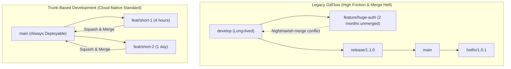

# Module 07: Enterprise Version Control & Git Discipline

**Session Reference:** 14:00 – 15:00 ICT  
**Topic:** Version Control System with Git: Enterprise Git Discipline & Integrity  
**Architect Roles:** Lead Cloud Architect & Principal Systems Architect  
**Methodologies:** Trunk-Based Development, Conventional Commits, Signed Commits, Monorepo Management

---

## 1. Executive Context: Git as the Single Source of Truth

In traditional software development, Git was merely a code repository—a tool for tracking changes and coordinating software releases. 

In a **GitOps and Cloud-Native architecture**, Git's role expands dramatically: **Git is the declarative single source of truth for the entire enterprise system**.
- If a Kubernetes deployment is not committed to Git, it does not exist.
- If an infrastructure modification is made directly in a cloud console without a Git commit, it is classified as **configuration drift** and automatically purged.
- Every commit SHA represents an auditable, cryptographically verifiable state of production at a specific point in time.

Consequently, sloppy Git habits—long-lived branches, unreviewed commits, unverified author signatures, and messy merge commits—are no longer minor nuisances; they represent **severe operational and security vulnerabilities**.

---

## 2. Branching Strategies: Trunk-Based Development vs. Legacy GitFlow



### Why GitFlow Fails in Cloud-Native GitOps
1. **Merge Conflicts:** Long-lived `develop` and `feature` branches diverge over weeks, leading to catastrophic merge conflicts ("Merge Hell").
2. **Batch Sizing:** Accumulating 50 changes into a single release branch violates the core principle of small batch size, dramatically inflating the blast radius of any defect.
3. **Drift between Develop and Main:** Maintaining dual long-lived branches obscures which exact configuration belongs in staging versus production.

### The Solution: Trunk-Based Development (TBD)
- Developers create short-lived branches (< 24 hours lifespan).
- Branches are merged into `main` (the trunk) multiple times per day via Pull Requests.
- Merges to `main` immediately trigger automated CI testing, security scanning, container builds, and staging deployment.
- Feature releases are decoupled from deployments using **Feature Flags** (LaunchDarkly, Unleash, or database flags).

---

## 3. Cryptographic Commit Signing & Identity Integrity

In default Git, anyone can forge any author name and email address:
```bash
# Anyone can spoof an executive or security engineer!
git commit --author="CTO <cto@company.com>" -m "Bypass auth check"
```

To prevent commit spoofing and satisfy enterprise compliance (SOC2, ISO27001), all commits must be **cryptographically signed using SSH or GPG keys**.

### Configuring SSH Commit Signing (Modern Standard)

```bash
# 1. Configure Git to use SSH for signing
git config --global gpg.format ssh
git config --global user.signingkey ~/.ssh/id_ed25519.pub

# 2. Enforce signing on all commits automatically
git config --global commit.gpgsign true

# 3. Create a signed commit
git commit -m "feat(auth): enforce MFA requirement on organizer login"

# 4. Verify the cryptographic signature
git log --show-signature -1
```

*In GitHub/GitLab, verified signed commits receive a cryptographic **`Verified`** badge, and branch protection rules block any PR containing unsigned commits.*

---

## 4. Commit Hygiene & Automated Semantic Releases

Enterprise repositories enforce **Conventional Commits** to automate Semantic Versioning (`MAJOR.MINOR.PATCH`) and changelog generation:

### Format Specification
$$\text{type}(\text{scope}): \text{short description}$$

- `feat(orders): add idempotency key support to checkout API` ➔ Triggers **MINOR** bump (`v1.2.0` ➔ `v1.3.0`)
- `fix(scanner): correct gate turnstile QR timeout threshold` ➔ Triggers **PATCH** bump (`v1.2.0` ➔ `v1.2.1`)
- `feat(auth)!: replace legacy API keys with OAuth2 bearer tokens` ➔ Triggers **MAJOR** bump (`v1.2.0` ➔ `v2.0.0`)

### Automated Release Automation (`release-please` or `semantic-release`)

```yaml
# GitHub Actions: Automated Release PR & Changelog
name: Release Please

on:
  push:
    branches:
      - main

permissions:
  contents: write
  pull-requests: write

jobs:
  release-please:
    runs-on: ubuntu-latest
    steps:
      - uses: googleapis/release-please-action@v4
        with:
          release-type: node
          package-name: gvents-core-platform
```

---

## 5. Enterprise Monorepo vs. Polyrepo Architecture

| Architectural Dimension | Polyrepo (One Repo per Microservice) | Monorepo (Single Unified Repository) |
| :--- | :--- | :--- |
| **Atomic Changes** | Extremely difficult (requires coordinating 5 PRs) | **Seamless (Single PR modifies API, Client & DTO)** |
| **Code Sharing** | Requires publishing internal npm/tar packages | **Direct workspace references (`pnpm-workspace`)** |
| **CI Performance** | Fast per repo, but uncoordinated | **High speed with cache acceleration (Turborepo / Nx)** |
| **Dependency Drift** | Each repo runs different versions of libraries | **Unified single version of dependencies** |
| **GitOps Boundary** | Config scattered across dozens of repos | **Consolidated `/k8s` or dedicated config repository** |

### Monorepo Path Filtering in CI (Avoid Rebuilding Everything)

```yaml
# Only build and test the affected service on commit
on:
  push:
    paths:
      - 'gvents-api-v2/**'
      - 'pnpm-lock.yaml'
```

---

## 6. Enterprise Branch Protection Rule Checklist

- [ ] **Require Pull Request Reviews:** Minimum 2 senior approvals before merging to `main`.
- [ ] **Dismiss Stale Approvals:** New commits immediately reset previous PR approvals.
- [ ] **Require Status Checks to Pass:** CI tests, linting, and Trivy security scans must pass.
- [ ] **Require Signed Commits:** Block any commit lacking a verified cryptographic GPG/SSH signature.
- [ ] **Require Linear History:** Enforce **Squash and Merge** or **Rebase and Merge** to eliminate empty merge commits.
- [ ] **Block Force Pushing:** Prevent `git push --force` or branch deletion on protected branches.
