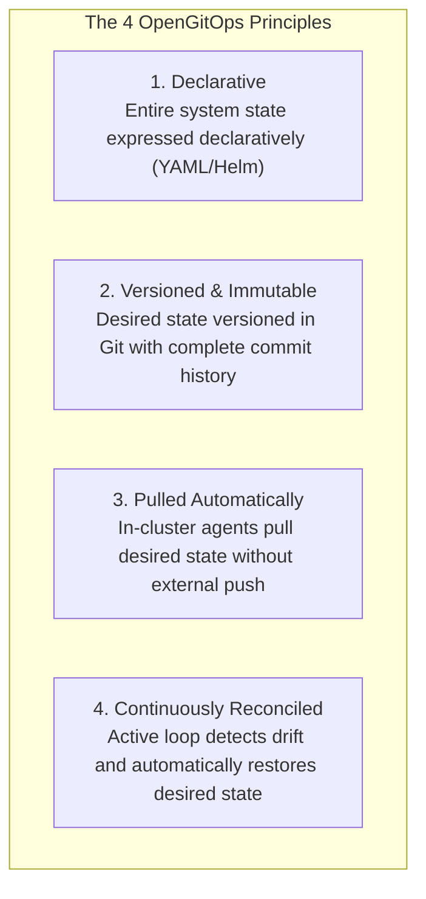
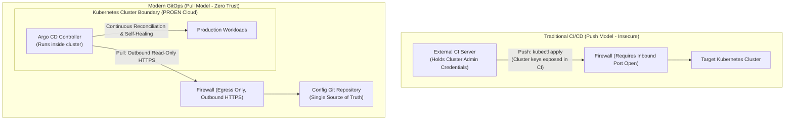

# Module 08: GitOps Principles & Core Concepts

**Session Reference:** 15:30 – 16:00 ICT  
**Topic:** แนวคิด GitOps และหลักการสำคัญของ GitOps  
**Architect Roles:** Lead Cloud Architect & Principal Platform Engineer  
**Standard:** OpenGitOps Working Group (Cloud Native Computing Foundation - CNCF)

---

## 1. Executive Context: Why GitOps Replaced Imperative DevOps

In traditional continuous delivery (the **"Push Model"**), CI/CD servers (Jenkins, GitLab CI, GitHub Actions) were granted administrative credentials (`kubeconfig` with cluster-admin access) to target clusters. At the end of every pipeline, the runner executed imperative commands:
```bash
# Traditional Imperative Anti-Pattern
kubectl apply -f deployment.yaml
kubectl set image deployment/core-api api=registry.proen.cloud/api:v2.1
```

This model broke down in enterprise production environments due to three critical flaws:
1. **Security & Blast Radius:** If an external CI runner was compromised, attackers acquired full administrative keys to the internal Kubernetes cluster.
2. **Configuration Drift:** When an operator manually patched a Pod or scaled replicas using `kubectl edit` during a crisis, those changes were never captured in version control.
3. **No Declarative Audit Trail:** Determining who changed what, when, and why required sifting through fragmented CI server console logs rather than a clean Git history.

**GitOps** transforms operational management by establishing **Git as the declarative, single source of truth**, managed by an **in-cluster reconciliation agent**.

---

## 2. The Four OpenGitOps Principles (CNCF Standard)

The Cloud Native Computing Foundation (CNCF) OpenGitOps Working Group defines the four immutable tenets of GitOps:



### Principle 1: Declarative System Description
The entire desired state of the environment—compute, networking, ingress, RBAC, environment variables—must be expressed declaratively. You describe **what** the system should look like, not the sequence of imperative commands to get there.

### Principle 2: Versioned and Immutable State
Desired state is versioned in a Git repository. Every change is an immutable commit. If a deployment causes a regression, rolling back the production system is as simple and fast as running `git revert <commit-sha>`.

### Principle 3: Pulled Automatically
Software agents running *inside* the target environment pull the desired state from the repository. External systems are never permitted to push commands directly into production.

### Principle 4: Continuously Reconciled (Self-Healing)
Software agents continuously monitor the **Actual State** of the cluster against the **Desired State** declared in Git. When divergence occurs, the controller automatically takes corrective action to heal the system.

---

## 3. Push vs. Pull: Security & Architectural Boundary



### Key Security Advantages of the Pull Model
- **No Inbound Firewall Holes:** The cluster requires zero open inbound management ports.
- **Credential Isolation:** The CI server has zero knowledge of the Kubernetes cluster. Even if GitHub/GitLab is completely breached, attackers cannot access internal databases or execute commands on Pods.
- **Least Privilege:** Argo CD operates within the cluster using fine-grained native Kubernetes Service Accounts and RBAC roles.

---

## 4. Configuration Drift: Automated Detection & Self-Healing

What happens when an engineer logs into the cluster and imperatively changes the environment?

*Scenario:* A rogue administrator runs:
```bash
# Imperative mutation directly on the live cluster
kubectl scale deployment core-api --replicas=0 -n production
```

In a traditional setup, the service remains down until someone notices.  
In a **GitOps architecture with Argo CD**:
1. Argo CD's continuous reconciliation loop detects a difference between **Actual State** (`replicas: 0`) and **Desired State** in Git (`replicas: 3`).
2. The application transitions immediately to **`OutOfSync`**.
3. If **Automated Self-Healing (`selfHeal: true`)** is enabled, Argo CD immediately issues an API update to scale the deployment back to `replicas: 3`.
4. The rogue mutation is overridden in seconds, and an audit alert is dispatched to the security Slack/Discord channel.

---

## 5. Enterprise Repository Architecture: Code vs. Config

A common enterprise anti-pattern is storing application source code and Kubernetes deployment manifests in the exact same Git repository.

### Why You Must Separate App Code and Config Repositories:
1. **Infinite CI Build Loops:** When CI finishes building a container, it must update the image tag in the deployment YAML. If both live in the same repo, that commit triggers a new CI build loop.
2. **Clean Access Boundaries:** Developers need write access to Application code, but only senior architects and automated release bots should have approval rights over production environment configurations.
3. **Multi-Environment Promotion:** A single application image tag must be promoted across `development` -> `staging` -> `production` config folders without touching source code.

```
REPO 1: app-source-code.git (Developers write code)
├── src/
├── package.json
└── Dockerfile

REPO 2: gvents-gitops-config.git (Argo CD monitors this)
├── environments/
│   ├── staging/
│   │   ├── kustomization.yaml
│   │   └── deployment-patch.yaml (image: v1.3.0-rc1)
│   └── production/
│       ├── kustomization.yaml
│       └── deployment-patch.yaml (image: v1.2.0)
└── base/
    ├── deployment.yaml
    └── service.yaml
```
