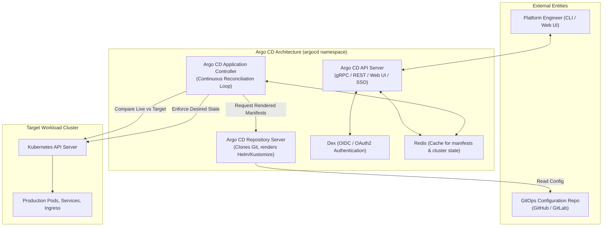
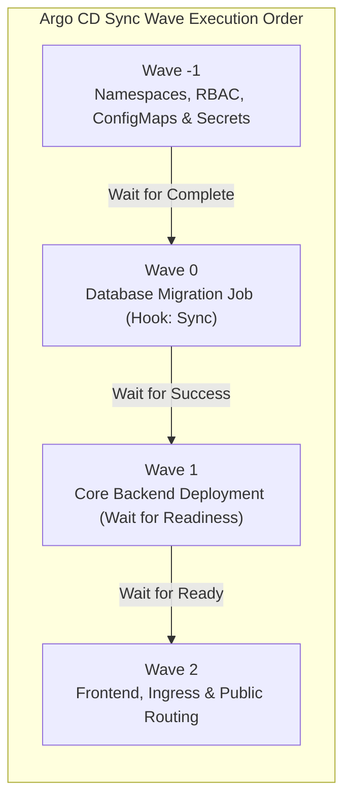

# Module 09: Hands-on Workshop: Application Delivery & Management with Argo CD

**Session Reference:** 16:00 – 16:45 ICT  
**Topic:** Workshop: การ Deploy และบริหาร Application ด้วย Argo CD  
**Architect Roles:** Lead Cloud Architect & Principal DevOps Specialist  
**Hands-on Environment:** PROEN Cloud Managed Kubernetes Cluster (ClassRoom 3 Target)

---

## 1. Executive Context & Workshop Objectives

This hands-on module transitions theoretical GitOps concepts into **production-grade implementation**. Attendees will deploy, configure, observe, and troubleshoot a containerized microservice running on Kubernetes using **Argo CD**.

### Workshop Learning Objectives
1. Connect a Git configuration repository to an in-cluster Argo CD instance.
2. Deploy a declarative Argo CD `Application` custom resource.
3. Master **Sync Waves** to enforce strictly ordered deployments (e.g., Database migrations before Web Pod rollout).
4. Simulate configuration drift and observe Argo CD's automated self-healing in real-time.
5. Scale to multi-cluster environments using the **ApplicationSet** pattern.

---

## 2. Argo CD Core Architecture

Argo CD operates entirely inside the Kubernetes cluster as a set of cooperating microservices:



---

## 3. Hands-on Lab 1: Deploying the Declarative Application CRD

In GitOps, we do not click buttons in the UI to create applications. We define an **`Application` Custom Resource Definition (CRD)** and commit it to Git.

### Manifest: `application-order-service.yaml`

```yaml
apiVersion: argoproj.io/v1alpha1
kind: Application
metadata:
  name: gvents-order-service
  namespace: argocd
  labels:
    environment: production
    team: ticketing
  finalizers:
    # Cascade deletion: Deleting this Application deletes all managed K8s resources
    - resources-finalizer.argocd.argoproj.io
spec:
  project: default
  source:
    repoURL: https://github.com/3lVv0w/code-to-cloud-workshop.git
    targetRevision: main
    path: workshop-setup/04-gitops-manifests/base
  destination:
    server: https://kubernetes.default.svc
    namespace: production
  syncPolicy:
    automated:
      prune: true     # Automatically delete resources removed from Git
      selfHeal: true  # Automatically revert manual out-of-band cluster edits
    syncOptions:
      - CreateNamespace=true
      - ApplyOutOfSyncOnly=true
    retry:
      limit: 5
      backoff:
        duration: 5s
        factor: 2
        maxDuration: 3m
```

### Applying the Application
```bash
# Apply the declarative application manifest
kubectl apply -f application-order-service.yaml -n argocd

# Monitor synchronization via Argo CD CLI
argocd app get gvents-order-service
```

---

## 4. Hands-on Lab 2: Ordered Deployments with Sync Waves

In distributed systems, deploying all manifests simultaneously causes errors. For example:
- The backend application crashes if the PostgreSQL schema migration hasn't completed.
- The Ingress fails if the TLS Secret or Custom Resource Definition (CRD) isn't ready.

Argo CD solves this using **Sync Waves (`argocd.argoproj.io/sync-wave`)**. Resources in lower-numbered waves are fully healthy before higher waves begin.



### Manifest Example: Migration Job (Wave 0)

```yaml
apiVersion: batch/v1
kind: Job
metadata:
  name: db-migrate-v1-3-0
  namespace: production
  annotations:
    argocd.argoproj.io/hook: Sync
    argocd.argoproj.io/hook-delete-policy: HookSucceeded
    argocd.argoproj.io/sync-wave: "0" # Runs before Wave 1 deployments
spec:
  template:
    spec:
      restartPolicy: OnFailure
      containers:
        - name: migration-runner
          image: registry.proen.cloud/gvents/core-api:1.3.0
          command: ["pnpm", "db:migrate:prod"]
          envFrom:
            - secretRef:
                name: db-credentials
```

### Manifest Example: Backend Deployment (Wave 1)

```yaml
apiVersion: apps/v1
kind: Deployment
metadata:
  name: core-api-backend
  namespace: production
  annotations:
    argocd.argoproj.io/sync-wave: "1" # Only deploys AFTER Wave 0 job succeeds
spec:
  replicas: 3
  # Deployment specification...
```

---

## 5. Hands-on Lab 3: Chaos & Self-Healing Verification

To verify that GitOps guarantees system resilience against manual errors:

### Step 1: Intentionally Mutate the Live Cluster
```bash
# A rogue operator manually deletes 2 replicas from production
kubectl scale deployment core-api-backend --replicas=1 -n production
```

### Step 2: Observe Argo CD Detection
1. Within seconds, Argo CD's controller detects that the live state (`replicas: 1`) does not match Git (`replicas: 3`).
2. Argo CD flags the application status as **`OutOfSync`**.

### Step 3: Automated Self-Healing Execution
Because `selfHeal: true` is configured:
1. Argo CD immediately re-applies the Git specification.
2. The deployment scales back up to 3 replicas automatically.
3. The cluster returns to the **`Synced`** and **`Healthy`** state without human intervention.

---

## 6. Hands-on Lab 4: Multi-Cluster Management with ApplicationSet

Managing 50 microservices across Development, Staging, and Production by hand is unmaintainable. The **ApplicationSet controller** automatically generates Argo CD applications from templates.

```yaml
apiVersion: argoproj.io/v1alpha1
kind: ApplicationSet
metadata:
  name: gvents-microservices-generator
  namespace: argocd
spec:
  generators:
    - matrix:
        generators:
          - git:
              repoURL: https://github.com/3lVv0w/code-to-cloud-workshop.git
              revision: main
              directories:
                - path: apps/*
          - list:
              elements:
                - cluster: in-cluster
                  environment: staging
                - cluster: in-cluster
                  environment: production
  template:
    metadata:
      name: '{{path.basename}}-{{environment}}'
    spec:
      project: default
      source:
        repoURL: https://github.com/3lVv0w/code-to-cloud-workshop.git
        targetRevision: main
        path: '{{path}}/environments/{{environment}}'
      destination:
        server: https://kubernetes.default.svc
        namespace: '{{environment}}'
      syncPolicy:
        automated:
          prune: true
          selfHeal: true
```

---

## 7. Operational Troubleshooting Runbook

| Status in Argo CD | Root Cause | Immediate Diagnostic Command | Remediation Action |
| :--- | :--- | :--- | :--- |
| **`Degraded`** | Pods failing health checks (`CrashLoopBackOff` or failed `readinessProbe`). | `kubectl describe pod <pod-name> -n <ns>` | Inspect container logs for runtime database connection errors. |
| **`OutOfSync`** | Git commit pushed but not synced, or manual drift detected. | `argocd app diff <app-name>` | Review git diff. Click **Sync** or verify `selfHeal` configuration. |
| **`SyncFailed`** | Invalid Kubernetes manifest schema or immutable field modification. | `argocd app get <app-name> --refresh` | Check if attempting to modify immutable fields (e.g., `spec.clusterIP`). Delete and recreate resource. |
| **`ComparisonError`** | Helm values missing or Kustomize syntax error in Git repo. | `argocd repo get-manifests <app-name>` | Run `helm lint` or `kustomize build` locally before pushing to Git. |
