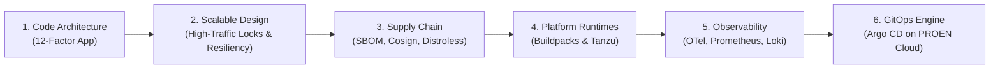
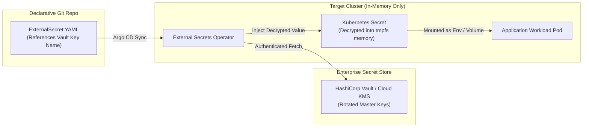
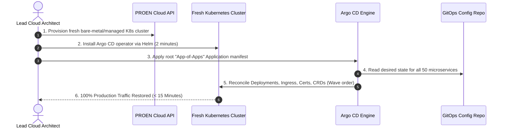
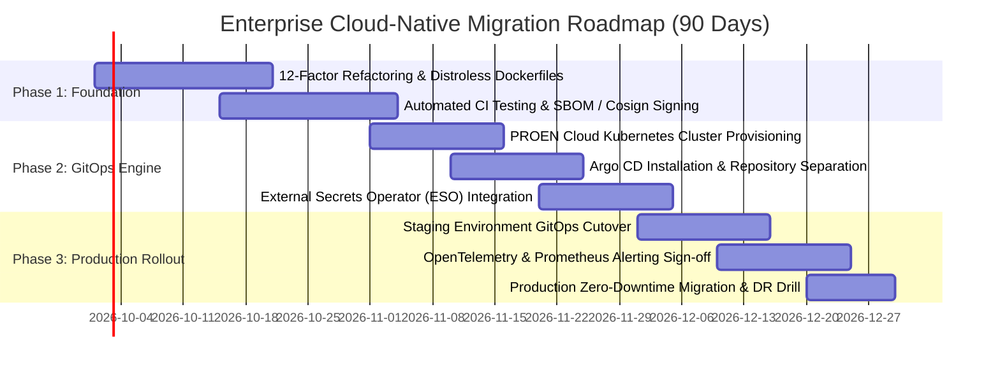

# Module 10: Synthesis, Day-2 Operations & Enterprise Adoption Roadmap

**Session Reference:** 16:45 – 17:00 ICT  
**Topic:** สรุปบทเรียน และแนวทางนำไปประยุกต์ใช้ / Q&A  
**Architect Roles:** Lead Cloud Architect & Principal Enterprise Strategist  
**Focus:** Day-2 Operations, GitOps Secret Management, Disaster Recovery, FinOps

---

## 1. Executive Synthesis: The Cloud-Native Journey

Over the course of this workshop, practitioners traversed the complete Cloud-Native continuum:



By connecting these layers, organizations achieve the ultimate goal of platform engineering: **high deployment velocity without sacrificing enterprise security, compliance, or operational stability**.

---

## 2. Day-2 Operations: Secrets Management in GitOps

The single most common stumbling block in enterprise GitOps adoption is: **"How do we manage passwords, API tokens, and private keys if Git is the single source of truth?"**

### The Critical Rule: Never Commit Plaintext Secrets to Git
Committing base64-encoded strings (`echo -n "secret" | base64`) to Git offers zero security. Base64 is an encoding format, not encryption.

### The Enterprise Standard: External Secrets Operator (ESO)
In modern architectures, secrets are stored in a centralized, auditable secrets manager (HashiCorp Vault, AWS Secrets Manager, or PROEN Cloud KMS). The **External Secrets Operator (ESO)** synchronizes them directly into native Kubernetes Secrets in memory:



### Manifest Example: `ExternalSecret` Specification

```yaml
apiVersion: external-secrets.io/v1beta1
kind: ExternalSecret
metadata:
  name: gvents-db-secret
  namespace: production
spec:
  refreshInterval: 1h # Automatically rotate secrets every hour
  secretStoreRef:
    name: vault-backend
    kind: ClusterSecretStore
  target:
    name: db-credentials # The native K8s secret created in the namespace
    creationPolicy: Owner
  data:
    - secretKey: database-url
      remoteRef:
        key: production/gvents/database
        property: connection_string
```

---

## 3. 15-Minute Disaster Recovery (DR) via GitOps

In traditional infrastructure, recovering from a catastrophic data center failure took days of reconstructing virtual machines and running ad-hoc scripts.

With GitOps, **entire cluster environments are fully disposable and reproducible**:



---

## 4. Top 5 Enterprise Anti-Patterns to Avoid

| # | Anti-Pattern | Operational Risk | Architectural Remedy |
| :---: | :--- | :--- | :--- |
| **1** | **Plaintext Secrets in Git** | Immediate credential leak upon repository cloning. | External Secrets Operator (ESO) + HashiCorp Vault. |
| **2** | **Mutable Image Tags (`:latest`)** | Rollbacks impossible; non-reproducible builds across pods. | Immutable digests (`@sha256:...`) or strict SemVer Git tags. |
| **3** | **Running CI Builds inside Prod Cluster** | Compromised build runner can compromise production kernel. | Isolated, ephemeral CI runners outside the production boundary. |
| **4** | **Manual Emergency `kubectl apply`** | Configuration drift; changes wiped out on next Argo CD sync. | Always commit hotfixes to Git; let Argo CD reconcile in seconds. |
| **5** | **Deploying Without Resource Limits** | One rogue memory leak triggers cluster-wide node starvation (OOM). | Enforce explicit `requests` and `limits` via cluster admission policies. |

---

## 5. Enterprise GitOps & Cloud-Native Adoption Roadmap



---

## 6. Curated Reference Reading & Standard Specifications

1. **OpenGitOps Working Group Standard:** [https://opengitops.dev/](https://opengitops.dev/)
2. **The 12-Factor App Methodology:** [https://12factor.net/](https://12factor.net/)
3. **Supply-chain Levels for Software Artifacts (SLSA):** [https://slsa.dev/](https://slsa.dev/)
4. **Argo CD Official Architectural Documentation:** [https://argo-cd.readthedocs.io/](https://argo-cd.readthedocs.io/)
5. **OpenTelemetry Specifications & Best Practices:** [https://opentelemetry.io/docs/](https://opentelemetry.io/docs/)
6. **DORA Research & DevOps Benchmarks:** [https://dora.dev/](https://dora.dev/)
