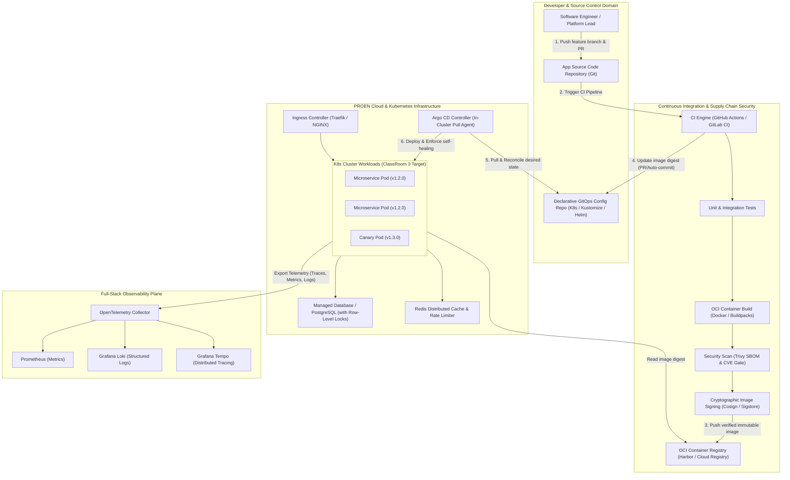

# Code to PROEN Cloud, GitOps & Argo CD Workshop: Architecture Syllabus & Technical Playbook

**Event Reference:** Gvents Event #30  
**Host Organizer:** Thai Programmer Association (สมาคมโปรแกรมเมอร์ไทย)  
**Industry Partners & Sponsors:** PROEN Corp Public Company Limited, VMware by Broadcom  
**Event Date & Time:** Monday, September 21, 2026 | 08:30 – 17:00 ICT (`Asia/Bangkok`)  
**Venue:** ClassRoom 3, True Digital Park, Bangkok, Thailand  
**Canonical Portal:** [https://events.gracer.co.th/event/detail/f6dpl5d4v0d-1788785028656](https://events.gracer.co.th/event/detail/f6dpl5d4v0d-1788785028656)  
**Document Classification:** Technical Architecture & Hands-on Workshop Curriculum  
**Architect Roles:** Lead Cloud Architect & Principal Systems Architect

---

## 1. Executive Summary & Architectural Vision

Modern enterprise software delivery has shifted irreversibly from manual, imperative server administration to **declarative, automated, and immutable Cloud-Native infrastructure**. 

This syllabus and technical repository serves as the definitive reference manual for the **Code to PROEN Cloud, GitOps & Argo CD Workshop**. Designed by cloud architects for enterprise developers, systems architects, and platform engineers, this curriculum guides practitioners across the full modern delivery lifecycle:

1. **Source Architecture:** Structuring applications according to 12-Factor principles for immutable execution.
2. **Resilience & Scale:** Designing microservices to withstand traffic surges without data loss.
3. **Supply Chain Integrity:** Securing the pipeline with SBOM generation, cryptographic signing (Cosign), and vulnerability gating before deployment.
4. **Cloud Runtimes:** Leveraging abstraction platforms (VMware Tanzu / Buildpacks) to eliminate infrastructure boilerplate.
5. **GitOps Engine:** Enforcing declarative system reconciliation, self-healing, and zero-trust cluster isolation using **Argo CD** on **PROEN Cloud** infrastructure.

### Official Masterclass Presentation Slides
- **English Edition (16:9 Landscape PDF):** [**`slides/presentation.pdf`**](slides/presentation.pdf) (48 Slides)
- **Thai Edition / ฉบับภาษาไทย (16:9 Landscape PDF):** [**`slides/presentation-th.pdf`**](slides/presentation-th.pdf) (48 Slides)
- **Interactive Presentation Deck:** Available locally at `slides/presentation.html` (EN) and `slides/presentation-th.html` (TH) with instant language toggle and keyboard navigation.

---

## 2. End-to-End Cloud-Native Delivery Topology

The following C4 Container / Pipeline diagram illustrates the target state architecture implemented throughout the workshop modules:



---

## 3. Curriculum Modules & Knowledge Index

Each module corresponds directly to the official workshop agenda, presenting production-grade patterns, concrete manifests, and operational runbooks.

| **Module** | Scheduled Time | Session Title & Core Focus | Architect Knowledge File |
| :--- | :---: | :--- | :--- |
| **Module 00** | 08:30 – 09:00 | **Registration, Orientation & Workstation Pre-Flight Check**<br>ClassRoom 3 logistics, network access, pre-flight environment check script | [`00_registration_and_orientation.md`](file:///Users/kvivek/Documents/gvents/docs/workshops/event-30-code-to-proen-cloud/00_registration_and_orientation.md) |
| **Module 01** | 09:00 – 09:30 | **Code to Cloud & 12-Factor App Principles**<br>Stateless concurrency, environment configuration, graceful shutdown, health probes | [`01_code_to_cloud_and_12_factor_app.md`](file:///Users/kvivek/Documents/gvents/docs/workshops/event-30-code-to-proen-cloud/01_code_to_cloud_and_12_factor_app.md) |
| **Module 02** | 09:30 – 10:30 | **Learning Mindset & High-Performing Engineering Culture**<br>Conway's Law, DORA metrics, blameless postmortems, psychological safety | [`02_learning_mindset_and_engineering_culture.md`](file:///Users/kvivek/Documents/gvents/docs/workshops/event-30-code-to-proen-cloud/02_learning_mindset_and_engineering_culture.md) |
| **Module 03** | 10:45 – 11:15 | **Microservices Architecture, Design Patterns & High-Traffic Management**<br>Saga pattern, Circuit Breakers, cache stampede prevention, distributed locking | [`03_microservices_architecture_and_high_traffic.md`](file:///Users/kvivek/Documents/gvents/docs/workshops/event-30-code-to-proen-cloud/03_microservices_architecture_and_high_traffic.md) |
| **Module 04** | 11:15 – 12:00 | **Software Supply Chain Management & DevSecOps**<br>SLSA framework, SBOM (Syft/Trivy), Cosign signature verification, minimal base images | [`04_software_supply_chain_management_and_security.md`](file:///Users/kvivek/Documents/gvents/docs/workshops/event-30-code-to-proen-cloud/04_software_supply_chain_management_and_security.md) |
| **Module 05** | 13:00 – 13:20 | **Enterprise Cloud Runtimes: "Here is my source code. Run it in the cloud…"**<br>Presented by VMware by Broadcom: Buildpacks, Tanzu Application Platform | [`05_vmware_broadcom_cloud_runtimes.md`](file:///Users/kvivek/Documents/gvents/docs/workshops/event-30-code-to-proen-cloud/05_vmware_broadcom_cloud_runtimes.md) |
| **Module 06** | 13:20 – 14:00 | **Cloud Services, Deployment Strategies & Full-Stack Observability**<br>PROEN Cloud topology, Canary vs Blue/Green, OpenTelemetry, RED & USE metrics | [`06_cloud_services_deployment_and_observability.md`](file:///Users/kvivek/Documents/gvents/docs/workshops/event-30-code-to-proen-cloud/06_cloud_services_deployment_and_observability.md) |
| **Module 07** | 14:00 – 15:00 | **Version Control System with Git: Enterprise Git Discipline**<br>Trunk-Based Development, commit signing (SSH/GPG), branch policies, release hygiene | [`07_version_control_system_with_git.md`](file:///Users/kvivek/Documents/gvents/docs/workshops/event-30-code-to-proen-cloud/07_version_control_system_with_git.md) |
| **Module 08** | 15:30 – 16:00 | **GitOps Principles & Core Concepts**<br>The 4 OpenGitOps principles, pull-based cluster reconciliation, eliminating CI push access | [`08_gitops_principles_and_core_concepts.md`](file:///Users/kvivek/Documents/gvents/docs/workshops/event-30-code-to-proen-cloud/08_gitops_principles_and_core_concepts.md) |
| **Module 09** | 16:00 – 16:45 | **Hands-on Workshop: Application Delivery & Management with Argo CD**<br>Declarative Application CRDs, Sync Waves, Automated Self-Healing, Rollout Canary | [`09_workshop_argo_cd_deployment_and_management.md`](file:///Users/kvivek/Documents/gvents/docs/workshops/event-30-code-to-proen-cloud/09_workshop_argo_cd_deployment_and_management.md) |
| **Module 10** | 16:45 – 17:00 | **Key Takeaways, Enterprise Adoption Roadmap & Architecture Review / Q&A**<br>Day-2 operations, Secret management (External Secrets Operator), migration strategy | [`10_key_takeaways_and_practical_applications.md`](file:///Users/kvivek/Documents/gvents/docs/workshops/event-30-code-to-proen-cloud/10_key_takeaways_and_practical_applications.md) |

---

## 4. Participant Pre-Flight Tooling Checklist (Windows, macOS & Linux)

Attendees can run on **Windows (PowerShell 5.1 / 7+ or WSL2)**, **macOS**, or **Linux**. Verify your workstation has the required CLI utilities prior to the hands-on lab sessions:

### Tool Verification (All Platforms):
```bash
# 1. Verify Git installation
git --version

# 2. Verify Docker Engine / Desktop
docker --version

# 3. Verify Kubernetes CLI (kubectl)
kubectl version --client

# 4. Verify Helm 3 package manager
helm version --short

# 5. Verify Argo CD CLI
argocd version --client

# 6. Verify Cosign (Container signature verification)
cosign version

# 7. (Recommended) Install K9s for terminal cluster management
k9s version
```

### Fast Package Manager Installation:
- **Windows (Winget):**
  ```powershell
  winget install Git.Git Docker.DockerDesktop Kubernetes.kubectl Helm.Helm
  winget install Argo.ArgoCD Sigstore.Cosign derailed.k9s
  ```
- **macOS (Homebrew):**
  ```bash
  brew install git kubectl helm argocd cosign k9s
  ```
- **Linux / WSL2:**
  Install Docker Engine via `apt`/`dnf` and fetch binary releases, or use `brew on linux` / `asdf`.


---

## 5. Course Instructors & Subject Matter Experts

- **คุณสฤษรัตน์ จิรทุลพรชัย** — CTO and Co-Founder @ Jumpbox
- **คุณกฤษฎา วิเวก** — กรรมการ สมาคมโปรแกรมเมอร์ไทย (Executive Committee Member, Thai Programmer Association)
- **คุณชาลี คัมภีรภาพ** — Solution Architect, VMware by Broadcom

---

## 6. Sponsoring Entities & Platform Infrastructure

- **PROEN Corp Public Company Limited:** Enterprise Internet Data Center (IDC), Cloud Compute & Network Backbone infrastructure.
- **VMware by Broadcom:** Enterprise Cloud Foundation & Tanzu Modern Application Platform.
- **Thai Programmer Association (สมาคมโปรแกรมเมอร์ไทย):** Developer advocacy, open standards, and technical talent acceleration.
